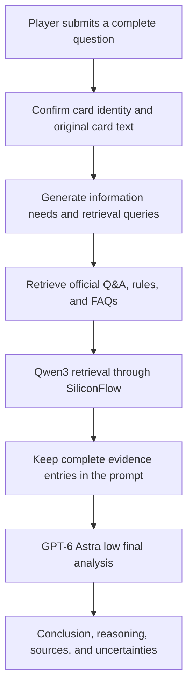

# Yu-Gi-Oh! OCG AI Rulings

[中文](README.md) | [English](README.en.md) | [日本語](README.ja.md)

[Use online](https://coldiceh.github.io/ocg-ruling-assistant/) · [Report an issue](https://github.com/coldiceh/ocg-ruling-assistant/issues)

Yu-Gi-Oh! OCG AI Rulings is built for OCG players. It combines card text, publicly available rule materials, and official Q&A to organize a conclusion, its reasoning, and supporting sources.

It is not an official KONAMI project and does not replace an event judge.

## What it can do

- Analyze questions about card activation, Chains, effect resolution, timing, replacement effects, and related interactions.
- Present a conclusion, reasoning, cited sources, and anything that still needs confirmation.
- Provide an unconfirmed analysis from complete effect text supplied by the user when a new card is not yet in the database.

## How it works

The public online route uses `cloud_evidence_v1`. It first confirms the card identities in the question and obtains the corresponding original card text; mentions that cannot be confirmed remain marked as unconfirmed. Exact-question lookup and direct answers from that shortcut are temporarily disabled. All public questions proceed through evidence retrieval and analysis, with official Q&A and FAQ retained as reference sources.

Based on the question and confirmed card text, the cloud route generates information needs and Japanese retrieval queries, then retrieves official Q&A, rules, and FAQs from the corpus. Production uses `Qwen/Qwen3-Embedding-0.6B` through SiliconFlow for dense retrieval combined with lexical retrieval; `Qwen/Qwen3-Reranker-8B` is currently disabled. Evidence selected for the prompt remains as complete entries: if a whole record does not fit the roughly 36,000-character prompt budget, that record is skipped instead of truncating retained entries.

The final response is produced by the default `GPT-6 Astra` with reasoning effort `low`. It analyzes the original question, confirmed card text, and the evidence prepared for that request, then returns a conclusion, reasoning, uncertainties, and source links.

## Data and reference sources

- [Official Yu-Gi-Oh! OCG Card Database and Q&A](https://www.db.yugioh-card.com/yugiohdb/)
- Publicly accessible card text, FAQs, rulebooks, and rule-learning materials

## Disclaimer

This is not an official KONAMI project. Its analysis may contain errors, omissions, or incorrect conclusions. For tournaments, local events, and official events, follow the official rules, the official database, the event organizer, and the judges on site.
