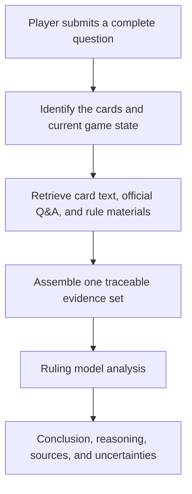

# Yu-Gi-Oh! OCG Ruling Assistant

[中文](README.md) | [English](README.en.md) | [日本語](README.ja.md)

[Use online](https://coldiceh.github.io/ocg-ruling-assistant/) · [Report an issue](https://github.com/coldiceh/ocg-ruling-assistant/issues)

This is a ruling analysis assistant for Yu-Gi-Oh! OCG players. It combines card text, publicly available rule materials, and official Q&A to organize a conclusion, its reasoning, and supporting sources.

It is not an official KONAMI project and does not replace an event judge.

## What it can do

- Analyze questions about card activation, Chains, effect resolution, timing, replacement effects, and related interactions.
- Present a conclusion, reasoning, cited sources, and anything that still needs confirmation.
- Provide an unconfirmed analysis from complete effect text supplied by the user when a new card is not yet in the database.
- Run reproducible fixed-set evaluations of models, reasoning effort, latency, accuracy, and cost.

## How it works

## Model and reasoning-effort evaluation

The tables summarize an anonymized evaluation of real ruling scenarios. This public report lists only accuracy, latency, tokens, theoretical cost, and technical-failure statistics; it does not display the questions, card names, or individual outputs.

<!-- MODEL_EFFORT_MATRIX:START -->

The evaluation contains 10 anonymized cases, with one call per case for each configuration. Accuracy is based on a semantic review of the raw answer, while partially correct answers are counted separately; empty responses, timeouts, truncation, and similar issues are summarized only as technical failures. Every configuration received the same frozen input for a given case, but the sample spans two prompt versions, so these are preliminary results rather than evidence of stability across repeated random runs.

### GPT‑5.6 models across six reasoning-effort levels

| Model | Reasoning effort | Correct | Partially correct | Mean / median latency | Tokens (input / output / reasoning / total) | Official theoretical total cost | Technical failures |
| --- | --- | ---: | ---: | ---: | ---: | ---: | --- |
| Luna | none | 10/10 | 0 | 41.5 / 37.9 s | 120,457 / 22,367 / 6,794 / 142,824 | $0.254659 | — |
| **Luna** | **low** | **10/10** | **0** | **34.6 / 31.3 s** | 120,457 / 18,133 / 2,014 / 138,590 | **$0.229255** | — |
| Luna | medium | 7/10 | 2 | 44.2 / 39.3 s | 123,487 / 22,697 / 8,275 / 146,184 | $0.259669 | 1 empty response |
| Luna | high | 9/10 | 1 | 139.8 / 126.2 s | 120,457 / 76,889 / 57,182 / 197,346 | $0.581791 | — |
| Luna | xhigh | 7/10 | 2 | 268.2 / 237.4 s | 123,487 / 145,316 / 124,278 / 268,803 | $0.995383 | 1 empty response |
| Luna | max | 6/10 | 0 | 284.0 / 267.2 s | 157,404 / 109,577 / 94,309 / 266,981 | $0.814866 | 4 empty responses |
| Terra | none | 7/10 | 1 | 43.7 / 41.4 s | 122,821 / 23,409 / 6,211 / 146,230 | $0.658188 | 1 empty response |
| Terra | low | 10/10 | 0 | 39.4 / 35.7 s | 120,457 / 21,090 / 3,307 / 141,547 | $0.617493 | — |
| Terra | medium | 8/10 | 1 | 41.9 / 39.5 s | 123,293 / 21,247 / 5,431 / 144,540 | $0.626938 | 1 empty response |
| Terra | high | 9/10 | 1 | 89.3 / 77.1 s | 120,457 / 48,212 / 29,577 / 168,669 | $1.024323 | — |
| Terra | xhigh | 9/10 | 1 | 195.7 / 199.0 s | 120,457 / 107,700 / 87,027 / 228,157 | $1.916643 | — |
| Terra | max | 4/10 | 1 | 574.9 / 541.8 s | 91,403 / 146,592 / 135,622 / 237,995 | $2.427388 (7/10 metered) | 3 timeouts; 2 empty responses |
| Sol | none | 10/10 | 0 | 78.3 / 69.0 s | 121,937 / 33,861 / 13,772 / 155,798 | $1.418155 | — |
| Sol | low | 10/10 | 0 | 51.6 / 47.9 s | 122,233 / 26,268 / 3,793 / 148,501 | $1.312805 | — |
| Sol | medium | 10/10 | 0 | 73.2 / 73.3 s | 122,233 / 33,827 / 14,475 / 156,060 | $1.556855 | — |
| Sol | high | 9/10 | 0 | 122.3 / 112.7 s | 123,980 / 49,507 / 31,647 / 173,487 | $2.087830 | 1 empty response |
| Sol | xhigh | 9/10 | 0 | 226.3 / 173.0 s | 123,675 / 94,257 / 74,322 / 217,932 | $3.428805 | 1 empty response |
| Sol | max | 8/10 | 0 | 465.5 / 349.6 s | 111,845 / 141,422 / 121,661 / 253,267 | $4.747741 (9/10 metered) | 1 timeout; 1 empty response |

In this sample, **Luna low** had the lowest mean latency and theoretical cost among all GPT‑5.6 configurations that achieved a perfect score, so the current public version uses it. Higher reasoning effort did not consistently improve accuracy and substantially increased latency, token usage, and the risk of technical failure.

### DeepSeek comparison

`Flash` and `Pro` are model variants, `standard` and `pro` are reasoning modes exposed by the API, and `none`, `high`, and `max` are the requested reasoning-effort levels. The provider determines how the latter two settings map to its actual backend.

| Model | Mode | Reasoning effort | Correct | Partially correct | Mean / median latency | Tokens (input / output / reasoning / total) | Official theoretical total cost | Technical failures |
| --- | --- | --- | ---: | ---: | ---: | ---: | ---: | --- |
| Flash | standard | none | 5/10 | 4 | 12.4 / 12.4 s | 115,416 / 16,671 / 0 / 132,087 | $0.014539 | — |
| Flash | pro | high | 1/10 | 0 | 78.4 / 84.7 s | 11,469 / 8,194 / 7,815 / 19,663 | $0.003268 (1/10 metered) | 9 upstream failures; 1 truncation |
| Pro | standard | none | 5/10 | 2 | 25.3 / 23.8 s | 115,416 / 19,534 / 0 / 134,950 | $0.047433 | 1 invalid format |
| Pro | pro | max | 4/10 | 0 | 146.4 / 147.2 s | 48,625 / 31,478 / 26,131 / 80,103 | $0.040255 (4/10 metered) | 6 upstream failures; 2 truncations |

DeepSeek's standard mode was fast and inexpensive, but its strict accuracy on this sample was insufficient for use as the primary ruling model. The many empty responses in pro mode came from upstream execution failures, so these results alone do not establish the model's rule-reasoning ability.

### Evidence ablation

| Anonymized sample | Evidence configuration | Correct | Partially correct | Mean / median latency | Total tokens | Official theoretical total cost |
| --- | --- | ---: | ---: | ---: | ---: | ---: |
| 10 cases | Card text only | 4/10 | 0 | 45.2 / 43.3 s | 76,855 | $0.876775 |
| 10 cases | Full evidence | 10/10 | 0 | 53.9 / 47.8 s | 148,201 | $1.300830 |

Rule and Q&A evidence produced a clear improvement on this sample.

GPT‑5.6 and DeepSeek costs are estimated from returned token usage and each provider's official standard API list prices. Actual provider multipliers, account balances, and billing are not used; configurations with incomplete metering are explicitly labeled.

<!-- MODEL_EFFORT_MATRIX:END -->

## Data and reference sources

- [Official Yu-Gi-Oh! OCG Card Database and Q&A](https://www.db.yugioh-card.com/yugiohdb/)
- Publicly accessible card text, FAQs, rulebooks, and rule-learning materials
- [Yu-Gi-Oh! rule materials compiled by Luo Jia](https://space.bilibili.com/869711)
- Complete card text and game-state information supplied by users in their questions

Third-party compilations, community materials, and user-supplied text are not labeled as direct official KONAMI rulings.

## Disclaimer

This is not an official KONAMI project. Its analysis may contain errors, omissions, or incorrect conclusions. For tournaments, local events, and official events, follow the official rules, the official database, the event organizer, and the judges on site.
