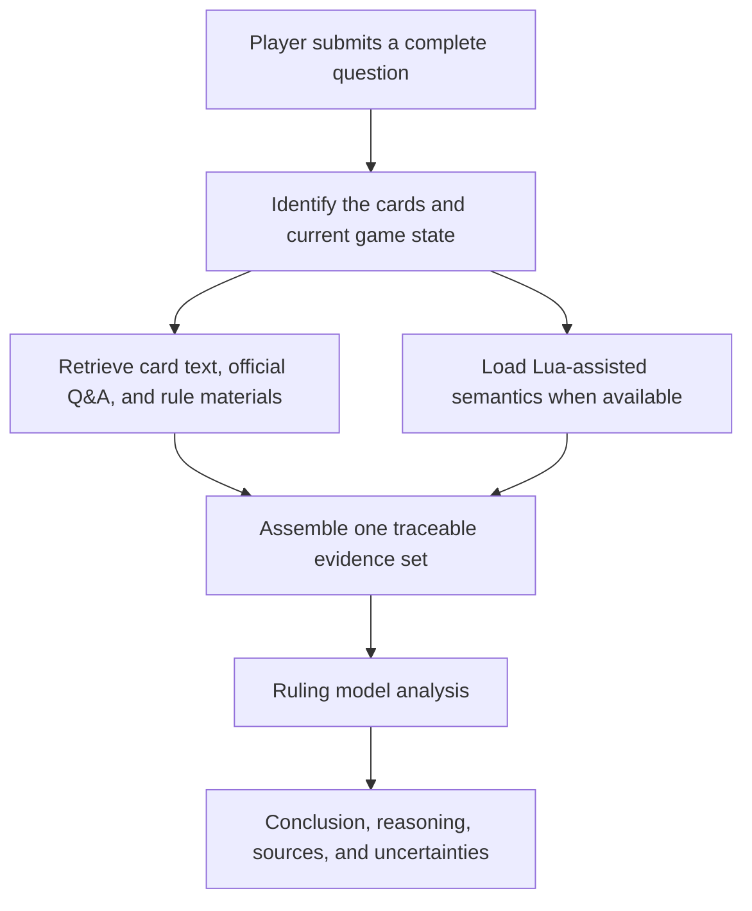

# Yu-Gi-Oh! OCG Ruling Assistant

[中文](README.md) | [English](README.en.md) | [日本語](README.ja.md)

[Use online](https://coldiceh.github.io/ocg-ruling-assistant/) · [Report an issue](https://github.com/coldiceh/ocg-ruling-assistant/issues)

This is a ruling analysis assistant for Yu-Gi-Oh! OCG players. It combines card text, publicly available rule materials, official Q&A, and available Lua-assisted semantics to organize a conclusion, its reasoning, and supporting sources.

It is not an official KONAMI project and does not replace an event judge.

## What it can do

- Analyze questions about card activation, Chains, effect resolution, timing, replacement effects, and related interactions.
- Present a conclusion, reasoning, cited sources, and anything that still needs confirmation.
- Provide an unconfirmed analysis from complete effect text supplied by the user when a new card is not yet in the database.
- Run reproducible fixed-set evaluations of models, reasoning effort, latency, accuracy, and cost.

## How it works



## What the current Lua / core component is

It is not currently a “complete YGOPro” that can independently answer every possible game state, and it does not directly decide the final ruling.

The core component mainly reads YGOPro card Lua scripts offline and turns statically identifiable operations, activation-legality dependencies, and low-level checks into structured summaries. The project has preprocessed roughly 13,500 scripts offline and deploys the results that contain useful legality checks as static website data. This means the online site can still use those preprocessed Lua summaries while your computer is turned off.

If a card has no script, its script is outside the current static-analysis scope, or the question requires the complete Duel state, this component explicitly falls back to “unknown.” The assistant will continue analyzing the question with card text, Q&A, rule materials, and the model, but it will not interpret a missing core result as “cannot activate.” The real-time core participates only during local development or when a separate service is configured; ordinary online questions do not require your computer to remain on.

## Model and reasoning-effort evaluation

The table below uses only a fixed evaluation set and the same frozen evidence. Gold answers are used for offline scoring only after a model has answered and are never sent to the model under evaluation. Empty responses, format failures, and unscorable outputs all count toward the number of planned calls. This project has not independently verified the identity or pricing of models accessed through a third-party relay; the relay dashboard is authoritative for actual charges.

<!-- MODEL_EFFORT_MATRIX:START -->

> The strict four-question matrix for all six reasoning-effort levels of Sol, Terra, and Luna is running serially on a remote worker. Per-question results, accuracy, latency, Token usage, and estimated cost will be added here when it is complete.

<!-- MODEL_EFFORT_MATRIX:END -->

## Data and reference sources

- [Official Yu-Gi-Oh! OCG Card Database and Q&A](https://www.db.yugioh-card.com/yugiohdb/)
- Publicly accessible card text, FAQs, rulebooks, and rule-learning materials
- [Fluorohydride/ygopro-core](https://github.com/Fluorohydride/ygopro-core) and the interface semantics of its YGOPro Lua scripts
- [Yu-Gi-Oh! rule materials compiled by Luo Jia](https://space.bilibili.com/869711)
- Complete card text and game-state information supplied by users in their questions

Third-party compilations, community materials, and user-supplied text are not labeled as direct official KONAMI rulings.

## Local development

Node.js 24 and pnpm are required.

```powershell
pnpm install
pnpm run dev
```

The default local page is `http://127.0.0.1:4173/`. More detailed setup, testing, and deployment instructions remain in the [`docs/`](docs/) directory instead of being placed on this player-facing front page.

## Contributing

Contributions of real ruling questions, verifiable sources, reproduction steps, and code changes are welcome. See [CONTRIBUTING.md](CONTRIBUTING.md).

## Disclaimer

This is not an official KONAMI project. Its analysis may contain errors, omissions, or incorrect conclusions. For tournaments, local events, and official events, follow the official rules, the official database, the event organizer, and the judges on site.
