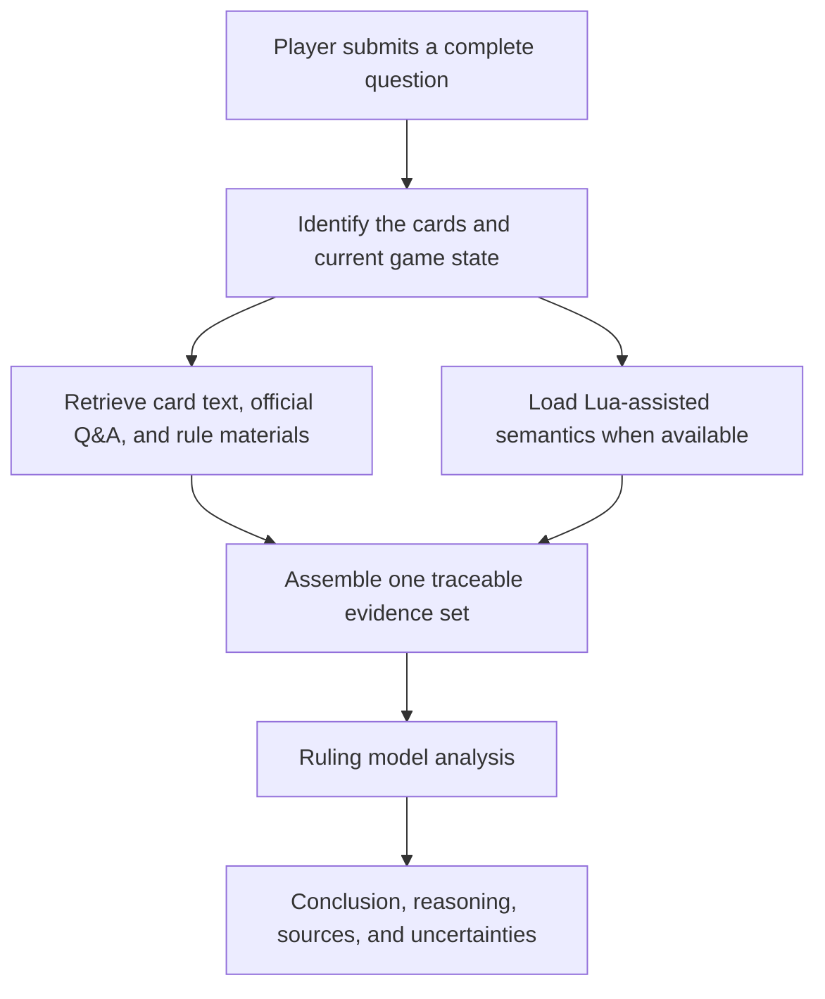

# Yu-Gi-Oh! OCG Ruling Assistant

[中文](README.md) | [English](README.en.md) | [日本語](README.ja.md)

[Use online](https://coldiceh.github.io/ocg-ruling-assistant/) · [Report an issue](https://github.com/coldiceh/ocg-ruling-assistant/issues)

This is a ruling analysis assistant for Yu-Gi-Oh! OCG players. It combines card text, publicly available rule materials, official Q&A, and available Lua-assisted semantics to organize a conclusion, its reasoning, and supporting sources.

It is not an official KONAMI project and does not replace an event judge.

## What it can do

- Analyze questions about card activation, Chains, effect resolution, timing, replacement effects, and related interactions.
- Present a conclusion, reasoning, cited sources, and anything that still needs confirmation.
- Provide an unconfirmed analysis from complete effect text supplied by the user when a new card is not yet in the database.
- Run reproducible fixed-set evaluations of models, reasoning effort, latency, accuracy, and cost.

## How it works

## Model and reasoning-effort evaluation

The table uses the same four fixed cases and frozen evidence. Accuracy is based on case-by-case semantic review of each raw answer by GPT‑5.6 Sol; structural checks are diagnostic only and do not contribute to accuracy. Costs are estimated from official standard API list prices and returned Token usage, not the relay's actual invoice.

<!-- MODEL_EFFORT_MATRIX:START -->

### Test cases

| No. | Case ID | Full question |
| --- | --- | --- |
| Q1 | double-tempest-impermanence | 对方场上只有表侧表示的风属性怪兽『绚岚之达象（絢嵐たるエルダム）』，我方以它为对象发动『无限泡影』，发动前场上没有其他魔法·陷阱卡。对方可以直接连锁发动手牌中『天雷之双风神 息那』的①效果吗？ |
| Q2 | unchained-replacement | 双方场上都只有一只怪兽。对方发动手牌中《破械冥官·篁（破械冥官カムラ）》的①效果，以自己场上的《破械焰魔天·阎摩（破械焔魔天ヤマ）》为对象；处理时对方适用《阎摩》的②效果，改为破坏我方场上的《完美电子多元驱动蛇·神龙（パーフェクトロン・ハイドライブ・ドラゴン）》。此时《神龙》能否再适用自己的③效果，降低1000攻击力来代替这次破坏？这次处理后，《篁》是否会特殊召唤？ |
| Q3 | accel-synchro-trigger-window | 加速同调士c1加速同调，对手c2发动纠罪巧恐怖变成表侧，处理时加速同调士变成黑蔷薇龙，这里另开连锁纠罪巧恐怖c1，花龙c2想炸全场，这个处理正确吗，如果正确的话这里花龙没有错过这张卡同调召唤时的时点吗 |
| Q4 | lost-target-continue-resolution | 类似于“谜式密码大师”的①效果和“无垢者·墨迪乌斯”的②效果这种，效果发动后，对象丢失会怎么处理？是按照《处理到不能处理为止》还是直接判定《对象丢失，不进行处理》？举例：双方主要阶段，对方以场上的《恩底弥翁的侍女·杰妮》为对象发动了《谜式密码大师》的①效果，我方连锁场上的《恩底弥翁的侍女·杰妮》以自己为对象发动了自己的②效果。处理的时候C2处理后，C1对象丢失，对方是否需要选一张手卡丢弃？举例2：我方场上存在怪兽，C1发动了《无垢者·墨迪乌斯》的②效果，对方连锁C2发动了手中的《深渊之兽·玛格巨龙》的①效果。处理的时候C2除外墓地的《无垢者·墨迪乌斯》，C1是否还需要将自己手牌、场上的一只怪兽返回卡组？ |

| Requested model | Returned model | Reasoning effort | Evidence variant | Q1 | Q2 | Q3 | Q4 | User-answer accuracy | Review coverage | Average / median total latency | Average / median first content | Input tokens | Output tokens | Reasoning tokens | Total tokens | Cost (total / per case / per correct answer) |
| --- | --- | --- | --- | --- | --- | --- | --- | --- | --- | --- | --- | --- | --- | --- | --- | --- |
| relay-gpt-5.6-sol | gpt-5.6-sol, Not returned (1) | none | Full evidence | Codex: Correct | Codex: Incorrect (empty response, 16.8 s) | Codex: Correct | Codex: Correct | 3/4 (75.0%) | 4/4 (100.0%) | 108.2 / 121.2 s | 84.9 / 95.0 s | 50,113 (4) | 15,950 (4) | 6,921 (4) | 66,063 (4) | USD 0.729065 / 0.182266 / 0.243022 (4/4) |
| relay-gpt-5.6-sol | gpt-5.6-sol | low | Card text only | Codex: Incorrect | Codex: Incorrect | Codex: Incorrect | Codex: Incorrect | 0/4 (0.0%) | 4/4 (100.0%) | 52.6 / 51.9 s | 18.7 / 17.2 s | 22,872 (4) | 8,733 (4) | 1,906 (4) | 31,605 (4) | USD 0.37635 / 0.094088 / — (4/4) |
| relay-gpt-5.6-sol | gpt-5.6-sol | low | Full evidence | Codex: Correct | Codex: Correct | Codex: Correct | Codex: Correct | 4/4 (100.0%) | 4/4 (100.0%) | 72.9 / 72.9 s | 19.7 / 19.7 s | 47,473 (4) | 13,068 (4) | 1,831 (4) | 60,541 (4) | USD 0.629405 / 0.157351 / 0.157351 (4/4) |
| relay-gpt-5.6-sol | gpt-5.6-sol | low | Without Lua | Codex: Correct | Codex: Correct | Not tested | Not tested | 2/2 (100.0%) | 2/2 (100.0%) | 56.5 / 56.5 s | 15.9 / 15.9 s | 21,984 (2) | 5,378 (2) | 801 (2) | 27,362 (2) | USD 0.27126 / 0.13563 / 0.13563 (2/2) |
| relay-gpt-5.6-sol | gpt-5.6-sol | medium | Full evidence | Codex: Correct | Codex: Correct | Codex: Correct | Codex: Partially correct | 3/4 (75.0%) | 4/4 (100.0%) | 114.4 / 101.6 s | 75.6 / 76.2 s | 50,320 (4) | 15,501 (4) | 7,102 (4) | 65,821 (4) | USD 0.71663 / 0.179158 / 0.238877 (4/4) |
| relay-gpt-5.6-sol | gpt-5.6-sol | high | Full evidence | Codex: Correct | Codex: Correct | Codex: Correct | Codex: Correct | 4/4 (100.0%) | 4/4 (100.0%) | 222.5 / 206.4 s | 163.8 / 159.2 s | 47,473 (4) | 32,703 (4) | 20,506 (4) | 80,176 (4) | USD 1.168919 / 0.29223 / 0.29223 (4/4) |
| relay-gpt-5.6-sol | gpt-5.6-sol, Not returned (1) | xhigh | Full evidence | Codex: Correct | Codex: Correct | Codex: Correct | Codex: Incorrect (empty response, 380.1 s) | 3/4 (75.0%) | 4/4 (100.0%) | 380.3 / 386.2 s | 334.8 / 353.2 s | 50,320 (4) | 46,385 (4) | 37,504 (4) | 96,705 (4) | USD 1.64315 / 0.410788 / 0.547717 (4/4) |
| relay-gpt-5.6-sol | gpt-5.6-sol, Not returned (2) | max | Full evidence | Codex: Correct | Codex: Correct | Codex: Incorrect (empty response, 788.3 s) | Codex: Incorrect (timed out, 900.0 s) | 2/4 (50.0%) | 4/4 (100.0%) | 645.0 / 634.9 s | 409.3 / 409.3 s | 37,606 (3) | 44,984 (3) | 38,677 (3) | 82,590 (3) | USD 1.53755 / 0.512517 / — (3/4) |

For xhigh, Q4 returned an empty response after 380.1 seconds. For max, Q3 returned an empty response after 788.3 seconds and Q4 explicitly timed out at 900.0 seconds. All count as unanswered for accuracy, but none represents an incorrect non-empty ruling.

The `Without Lua` variant tested only Q1 and Q2, and the Lua result in the full-evidence variant was `UNKNOWN` for both at the time. This shows only that removing `UNKNOWN` Lua metadata did not affect these two cases; it does not show that a useful Lua semantic summary has no value.

This evaluation currently contains only four cases, so these are preliminary results.

<!-- MODEL_EFFORT_MATRIX:END -->

## Data and reference sources

- [Official Yu-Gi-Oh! OCG Card Database and Q&A](https://www.db.yugioh-card.com/yugiohdb/)
- Publicly accessible card text, FAQs, rulebooks, and rule-learning materials
- [Fluorohydride/ygopro-core](https://github.com/Fluorohydride/ygopro-core) and the interface semantics of its YGOPro Lua scripts
- [Yu-Gi-Oh! rule materials compiled by Luo Jia](https://space.bilibili.com/869711)
- Complete card text and game-state information supplied by users in their questions

Third-party compilations, community materials, and user-supplied text are not labeled as direct official KONAMI rulings.

## Disclaimer

This is not an official KONAMI project. Its analysis may contain errors, omissions, or incorrect conclusions. For tournaments, local events, and official events, follow the official rules, the official database, the event organizer, and the judges on site.
