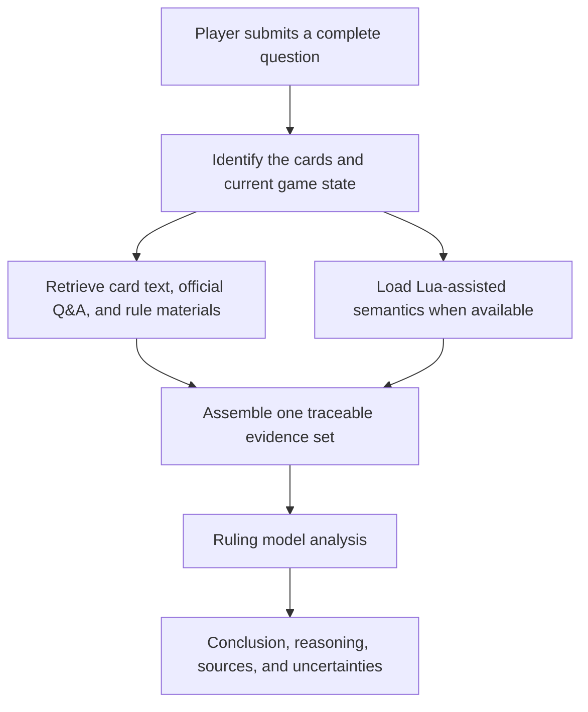

# Yu-Gi-Oh! OCG Ruling Assistant

[中文](README.md) | [English](README.en.md) | [日本語](README.ja.md)

[Use online](https://coldiceh.github.io/ocg-ruling-assistant/) · [Report an issue](https://github.com/coldiceh/ocg-ruling-assistant/issues)

This is a ruling analysis assistant for Yu-Gi-Oh! OCG players. It combines card text, publicly available rule materials, official Q&A, and available Lua-assisted semantics to organize a conclusion, its reasoning, and supporting sources.

It is not an official KONAMI project and does not replace an event judge.

## What it can do

- Analyze questions about card activation, Chains, effect resolution, timing, replacement effects, and related interactions.
- Present a conclusion, reasoning, cited sources, and anything that still needs confirmation.
- Provide an unconfirmed analysis from complete effect text supplied by the user when a new card is not yet in the database.
- Run reproducible fixed-set evaluations of models, reasoning effort, latency, accuracy, and cost.

## How it works

## Model and reasoning-effort evaluation

The table compares six reasoning-effort levels of GPT‑5.6 Sol on ten real ruling questions. Accuracy comes from case-by-case semantic review bound to each raw-output hash; structural checks and the Validator are diagnostic only. Costs are estimates based on official standard API list prices and returned Token usage, not the relay's actual invoice.

<!-- MODEL_EFFORT_MATRIX:START -->

### Preliminary ten-case evaluation

The ten cases cover these ruling themes:

1. Responding to a Trap when the required return-to-hand action may be impossible.
2. Nested destruction replacement and the follow-up Special Summon.
3. Trigger timing after a Synchro Summon during Chain resolution.
4. Continuing to resolve an effect after its target is lost.
5. Checking an archetype Continuous Spell's condition after a Chain resolves.
6. Activating a Trap while the opponent's entire hand is already public.
7. A lingering restriction on effects of monsters Special Summoned from the Extra Deck.
8. Combining two additional Normal Summons in one turn.
9. How the number of Fusion Materials affects an effect's usage count.
10. Direct-attack permission versus a monster that must be attacked.

Q1–Q4 used prompt SHA `0f6533ce…`; Q5–Q10 used `d368c635…`. The table is therefore a preliminary mixed-prompt evaluation, not a single perfectly uniform benchmark. For each individual case, however, all six effort levels received the same frozen input.

Accuracy comes only from case-by-case semantic review of what the model actually answered. The Validator is diagnostic and does not affect the accuracy score.

| Reasoning effort | Accuracy | Average total latency | Average time to first content | Total tokens | Theoretical cost (total / per case) | Unanswered or partial cases |
| --- | --- | ---: | ---: | ---: | ---: | --- |
| none | 9/10 | 83.0 s | 53.8 s | 158,075 | $1.417490 / $0.141749 | Q2: empty response |
| low | 10/10 | 53.9 s | 15.0 s | 148,201 | $1.300830 / $0.130083 | — |
| medium | 9/10 correct + 1 partial | 81.3 s | 51.4 s | 157,761 | $1.533735 / $0.153374 | Q4: truncated after unnecessary over-checking |
| high | 10/10 | 155.2 s | 116.1 s | 182,530 | $2.372484 / $0.237248 | — |
| xhigh | 9/10 | 247.3 s | 198.2 s | 216,435 | $3.375395 / $0.337540 | Q4: empty response |
| max | 7/10 | 441.6 s | 308.0 s | 224,570 (9/10 metered) | $3.837031 / $0.426337 (9/10 metered) | Q3: empty; Q4: timeout; Q6: empty |

These rows do not show opposite rulings at different effort levels. Every non-empty Q2 answer was correct. For Q4, none, low, medium, and high reached the same core ruling; medium was marked partial because it over-checked and its response was truncated. A single sample per case and effort level does not establish random-run stability.

On this small evaluation, **low is the recommended setting**: it matched high at 10/10 while being faster and less expensive.

### Evidence ablation at low effort

| Evidence variant | Accuracy | Average total latency | Average time to first content | Total tokens | Theoretical cost (total / per case) |
| --- | ---: | ---: | ---: | ---: | ---: |
| Card text only | 4/10 | 45.2 s | 17.4 s | 76,855 | $0.876775 / $0.087678 |
| Full evidence | 10/10 | 53.9 s | 15.0 s | 148,201 | $1.300830 / $0.130083 |
| Without Lua | 10/10 | 50.4 s | 11.3 s | 140,967 | $1.339285 / $0.133929 |

The comparison suggests that rule and Q&A evidence matters substantially. Lua semantics were available for only 3 of the 10 cases, and removing Lua did not reduce accuracy in this sample. This means no Lua benefit was observed here; it does not prove that Lua can never help on other cases.

Costs use the official theoretical pricing baseline `openai-gpt-5.6-standard-2026-07-09`, checked on 2026-08-02. They are not the third-party relay's invoice.

<!-- MODEL_EFFORT_MATRIX:END -->

## Data and reference sources

- [Official Yu-Gi-Oh! OCG Card Database and Q&A](https://www.db.yugioh-card.com/yugiohdb/)
- Publicly accessible card text, FAQs, rulebooks, and rule-learning materials
- [Fluorohydride/ygopro-core](https://github.com/Fluorohydride/ygopro-core) and the interface semantics of its YGOPro Lua scripts
- [Yu-Gi-Oh! rule materials compiled by Luo Jia](https://space.bilibili.com/869711)
- Complete card text and game-state information supplied by users in their questions

Third-party compilations, community materials, and user-supplied text are not labeled as direct official KONAMI rulings.

## Disclaimer

This is not an official KONAMI project. Its analysis may contain errors, omissions, or incorrect conclusions. For tournaments, local events, and official events, follow the official rules, the official database, the event organizer, and the judges on site.
