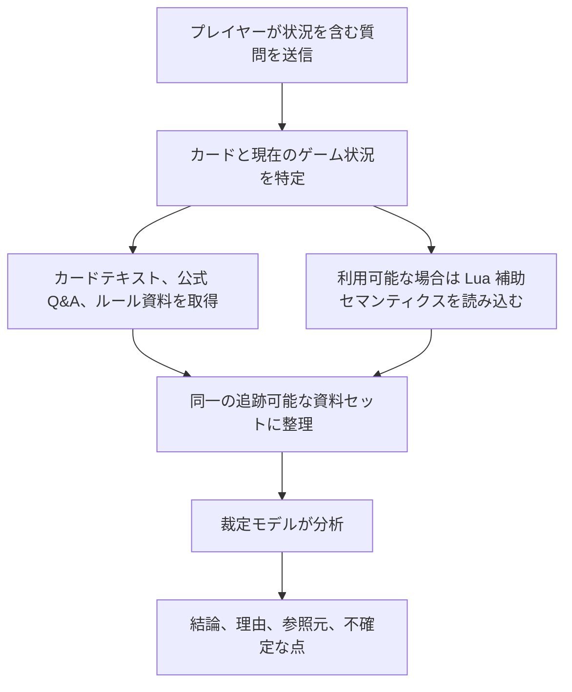

# 遊戯王 OCG 裁定アシスタント

[中文](README.md) | [English](README.en.md) | [日本語](README.ja.md)

[オンライン版を使う](https://coldiceh.github.io/ocg-ruling-assistant/) · [問題を報告する](https://github.com/coldiceh/ocg-ruling-assistant/issues)

遊戯王 OCG プレイヤー向けの裁定分析アシスタントです。カードテキスト、公開されているルール資料、公式 Q&A、利用可能な Lua 補助セマンティクスを組み合わせ、結論・理由・参照元を整理します。

KONAMI の公式プロジェクトではなく、公式大会におけるジャッジの判断に代わるものでもありません。

## できること

- カードの発動、チェーン、効果処理、タイミング、代替処理などの問題を分析します。
- 結論、分析理由、参照元、さらに確認が必要な点を表示します。
- 新しいカードがまだデータベースに収録されていない場合、ユーザーが貼り付けた完全な効果テキストをもとに未確認の分析を行います。
- モデル、推論強度、所要時間、正答率、費用を、固定問題セットで再現可能な形で評価します。

## 仕組み

## モデルと推論強度の評価

下表は固定した4問と同一の凍結済み資料を使用します。正答率は各生回答を GPT‑5.6 Sol が問題別に意味評価した結果に基づき、構造チェックは診断専用で正答率には含めません。費用は公式の標準 API 価格と返却 Token から推定したもので、中継サービスの実際の請求額ではありません。

<!-- MODEL_EFFORT_MATRIX:START -->

### テスト内容

| 番号 | Case ID | 質問全文 |
| --- | --- | --- |
| Q1 | double-tempest-impermanence | 对方场上只有表侧表示的风属性怪兽『绚岚之达象（絢嵐たるエルダム）』，我方以它为对象发动『无限泡影』，发动前场上没有其他魔法·陷阱卡。对方可以直接连锁发动手牌中『天雷之双风神 息那』的①效果吗？ |
| Q2 | unchained-replacement | 双方场上都只有一只怪兽。对方发动手牌中《破械冥官·篁（破械冥官カムラ）》的①效果，以自己场上的《破械焰魔天·阎摩（破械焔魔天ヤマ）》为对象；处理时对方适用《阎摩》的②效果，改为破坏我方场上的《完美电子多元驱动蛇·神龙（パーフェクトロン・ハイドライブ・ドラゴン）》。此时《神龙》能否再适用自己的③效果，降低1000攻击力来代替这次破坏？这次处理后，《篁》是否会特殊召唤？ |
| Q3 | accel-synchro-trigger-window | 加速同调士c1加速同调，对手c2发动纠罪巧恐怖变成表侧，处理时加速同调士变成黑蔷薇龙，这里另开连锁纠罪巧恐怖c1，花龙c2想炸全场，这个处理正确吗，如果正确的话这里花龙没有错过这张卡同调召唤时的时点吗 |
| Q4 | lost-target-continue-resolution | 类似于“谜式密码大师”的①效果和“无垢者·墨迪乌斯”的②效果这种，效果发动后，对象丢失会怎么处理？是按照《处理到不能处理为止》还是直接判定《对象丢失，不进行处理》？举例：双方主要阶段，对方以场上的《恩底弥翁的侍女·杰妮》为对象发动了《谜式密码大师》的①效果，我方连锁场上的《恩底弥翁的侍女·杰妮》以自己为对象发动了自己的②效果。处理的时候C2处理后，C1对象丢失，对方是否需要选一张手卡丢弃？举例2：我方场上存在怪兽，C1发动了《无垢者·墨迪乌斯》的②效果，对方连锁C2发动了手中的《深渊之兽·玛格巨龙》的①效果。处理的时候C2除外墓地的《无垢者·墨迪乌斯》，C1是否还需要将自己手牌、场上的一只怪兽返回卡组？ |

| リクエストモデル | 応答モデル | 推論強度 | 証拠構成 | Q1 | Q2 | Q3 | Q4 | ユーザー回答正答率 | レビュー網羅率 | 総所要時間（平均 / 中央値） | 最初の本文まで（平均 / 中央値） | 入力 Token | 出力 Token | 推論 Token | 合計 Token | 費用（合計 / 1問平均 / 正答1件あたり） |
| --- | --- | --- | --- | --- | --- | --- | --- | --- | --- | --- | --- | --- | --- | --- | --- | --- |
| relay-gpt-5.6-sol | gpt-5.6-sol, 未返却 (1) | none | 完全な証拠 | Codex: 正解 | Codex: 不正解（空の応答、16.8 s） | Codex: 正解 | Codex: 正解 | 3/4 (75.0%) | 4/4 (100.0%) | 108.2 / 121.2 s | 84.9 / 95.0 s | 50,113 (4) | 15,950 (4) | 6,921 (4) | 66,063 (4) | USD 0.729065 / 0.182266 / 0.243022 (4/4) |
| relay-gpt-5.6-sol | gpt-5.6-sol | low | カードテキストのみ | Codex: 不正解 | Codex: 不正解 | Codex: 不正解 | Codex: 不正解 | 0/4 (0.0%) | 4/4 (100.0%) | 52.6 / 51.9 s | 18.7 / 17.2 s | 22,872 (4) | 8,733 (4) | 1,906 (4) | 31,605 (4) | USD 0.37635 / 0.094088 / — (4/4) |
| relay-gpt-5.6-sol | gpt-5.6-sol | low | 完全な証拠 | Codex: 正解 | Codex: 正解 | Codex: 正解 | Codex: 正解 | 4/4 (100.0%) | 4/4 (100.0%) | 72.9 / 72.9 s | 19.7 / 19.7 s | 47,473 (4) | 13,068 (4) | 1,831 (4) | 60,541 (4) | USD 0.629405 / 0.157351 / 0.157351 (4/4) |
| relay-gpt-5.6-sol | gpt-5.6-sol | low | Lua なし | Codex: 正解 | Codex: 正解 | 未実施 | 未実施 | 2/2 (100.0%) | 2/2 (100.0%) | 56.5 / 56.5 s | 15.9 / 15.9 s | 21,984 (2) | 5,378 (2) | 801 (2) | 27,362 (2) | USD 0.27126 / 0.13563 / 0.13563 (2/2) |
| relay-gpt-5.6-sol | gpt-5.6-sol | medium | 完全な証拠 | Codex: 正解 | Codex: 正解 | Codex: 正解 | Codex: 一部正解 | 3/4 (75.0%) | 4/4 (100.0%) | 114.4 / 101.6 s | 75.6 / 76.2 s | 50,320 (4) | 15,501 (4) | 7,102 (4) | 65,821 (4) | USD 0.71663 / 0.179158 / 0.238877 (4/4) |
| relay-gpt-5.6-sol | gpt-5.6-sol | high | 完全な証拠 | Codex: 正解 | Codex: 正解 | Codex: 正解 | Codex: 正解 | 4/4 (100.0%) | 4/4 (100.0%) | 222.5 / 206.4 s | 163.8 / 159.2 s | 47,473 (4) | 32,703 (4) | 20,506 (4) | 80,176 (4) | USD 1.168919 / 0.29223 / 0.29223 (4/4) |
| relay-gpt-5.6-sol | gpt-5.6-sol, 未返却 (1) | xhigh | 完全な証拠 | Codex: 正解 | Codex: 正解 | Codex: 正解 | Codex: 不正解（空の応答、380.1 s） | 3/4 (75.0%) | 4/4 (100.0%) | 380.3 / 386.2 s | 334.8 / 353.2 s | 50,320 (4) | 46,385 (4) | 37,504 (4) | 96,705 (4) | USD 1.64315 / 0.410788 / 0.547717 (4/4) |
| relay-gpt-5.6-sol | gpt-5.6-sol, 未返却 (2) | max | 完全な証拠 | Codex: 正解 | Codex: 正解 | Codex: 不正解（空の応答、788.3 s） | Codex: 不正解（タイムアウト、900.0 s） | 2/4 (50.0%) | 4/4 (100.0%) | 645.0 / 634.9 s | 409.3 / 409.3 s | 37,606 (3) | 44,984 (3) | 38,677 (3) | 82,590 (3) | USD 1.53755 / 0.512517 / — (3/4) |

xhigh の Q4 は 380.1 秒後に空の応答となりました。max の Q3 は 788.3 秒後に空の応答となり、Q4 は 900.0 秒で明示的にタイムアウトしました。いずれも正答率では未回答として扱いますが、非空の裁定内容が誤っていたわけではありません。

`Lua なし` は Q1 と Q2 だけを対象とし、完全な証拠に含まれていた当時の Lua 結果も両問とも `UNKNOWN` でした。したがって、`UNKNOWN` の Lua メタデータを除いてもこの2問には影響しなかったことしか示せず、有効な Lua セマンティクス要約に価値がないことを示すものではありません。

現在の評価は4問だけであり、以上は予備的な結果です。

<!-- MODEL_EFFORT_MATRIX:END -->

## データと参照元

- [遊戯王 OCG 公式カードデータベースとカード Q&A](https://www.db.yugioh-card.com/yugiohdb/)
- 一般公開されているカードテキスト、FAQ、ルールブック、ルール学習資料
- [Fluorohydride/ygopro-core](https://github.com/Fluorohydride/ygopro-core) および YGOPro Lua スクリプトのインターフェースセマンティクス
- [羅伽氏がまとめた遊戯王ルール関連コンテンツ](https://space.bilibili.com/869711)
- ユーザーが質問内で提示した完全なカードテキストとゲーム状況

第三者による整理、コミュニティ資料、ユーザー提供のテキストを、KONAMI による直接の公式裁定として表示することはありません。

## 免責事項

本プロジェクトは KONAMI の公式プロジェクトではありません。分析には誤り、見落とし、誤判定が含まれる可能性があります。大会、店舗イベント、公式イベントでは、公式ルール、公式データベース、イベント主催者、現地ジャッジの判断に従ってください。
