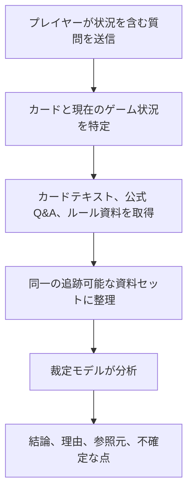

# 遊戯王 OCG 裁定アシスタント

[中文](README.md) | [English](README.en.md) | [日本語](README.ja.md)

[オンライン版を使う](https://coldiceh.github.io/ocg-ruling-assistant/) · [問題を報告する](https://github.com/coldiceh/ocg-ruling-assistant/issues)

遊戯王 OCG プレイヤー向けの裁定分析アシスタントです。カードテキスト、公開されているルール資料、公式 Q&A を組み合わせ、結論・理由・参照元を整理します。

KONAMI の公式プロジェクトではなく、公式大会におけるジャッジの判断に代わるものでもありません。

## できること

- カードの発動、チェーン、効果処理、タイミング、代替処理などの問題を分析します。
- 結論、分析理由、参照元、さらに確認が必要な点を表示します。
- 新しいカードがまだデータベースに収録されていない場合、ユーザーが貼り付けた完全な効果テキストをもとに未確認の分析を行います。
- モデル、推論強度、所要時間、正答率、費用を、固定問題セットで再現可能な形で評価します。

## 仕組み

## モデルと推論強度の評価

以下の表は、実際の裁定場面を匿名化して評価した結果です。この公開レポートには正答率、所要時間、Token、理論費用、技術的な失敗の統計だけを掲載し、具体的な問題、カード名、問題別の出力は表示しません。

円換算は 2026-08 時点の `1 USD ≈ ¥158.4` を用いた読みやすさのための概算です。実際の費用は USD 建ての理論単価と Token 使用量を基準とします。

<!-- MODEL_EFFORT_MATRIX:START -->

評価規模は匿名化した10問で、各構成につき各問を1回だけ実行しました。正答率は生の回答が実際に述べた内容を意味的に確認して算出し、一部正解は別に集計しています。空の応答、タイムアウト、出力の途切れなどは技術的な失敗としてのみ集計しました。同じ問題には各構成で同一の凍結入力を与えていますが、サンプルには2つのプロンプト版が含まれるため、これは予備的な評価であり、ランダムな再実行に対する安定性を示すものではありません。

### GPT‑5.6 の各モデルと6段階の推論強度

| モデル | 推論強度 | 正答 | 一部正解 | 平均 / 中央所要時間 | Token（入力 / 出力 / 推論 / 合計） | 公式理論総費用（USD / 円換算） | 技術的な失敗 |
| --- | --- | ---: | ---: | ---: | ---: | ---: | --- |
| Luna | none | 10/10 | 0 | 41.5 / 37.9秒 | 120,457 / 22,367 / 6,794 / 142,824 | USD 0.254659 約 ¥40 | — |
| **Luna** | **low** | **10/10** | **0** | **34.6 / 31.3秒** | 120,457 / 18,133 / 2,014 / 138,590 | **USD 0.229255** **約 ¥36** | — |
| Luna | medium | 7/10 | 2 | 44.2 / 39.3秒 | 123,487 / 22,697 / 8,275 / 146,184 | USD 0.259669 約 ¥41 | 空の応答 1 |
| Luna | high | 9/10 | 1 | 139.8 / 126.2秒 | 120,457 / 76,889 / 57,182 / 197,346 | USD 0.581791 約 ¥92 | — |
| Luna | xhigh | 7/10 | 2 | 268.2 / 237.4秒 | 123,487 / 145,316 / 124,278 / 268,803 | USD 0.995383 約 ¥158 | 空の応答 1 |
| Luna | max | 6/10 | 0 | 284.0 / 267.2秒 | 157,404 / 109,577 / 94,309 / 266,981 | USD 0.814866 約 ¥129 | 空の応答 4 |
| Terra | none | 7/10 | 1 | 43.7 / 41.4秒 | 122,821 / 23,409 / 6,211 / 146,230 | USD 0.658188 約 ¥104 | 空の応答 1 |
| Terra | low | 10/10 | 0 | 39.4 / 35.7秒 | 120,457 / 21,090 / 3,307 / 141,547 | USD 0.617493 約 ¥98 | — |
| Terra | medium | 8/10 | 1 | 41.9 / 39.5秒 | 123,293 / 21,247 / 5,431 / 144,540 | USD 0.626938 約 ¥99 | 空の応答 1 |
| Terra | high | 9/10 | 1 | 89.3 / 77.1秒 | 120,457 / 48,212 / 29,577 / 168,669 | USD 1.024323 約 ¥162 | — |
| Terra | xhigh | 9/10 | 1 | 195.7 / 199.0秒 | 120,457 / 107,700 / 87,027 / 228,157 | USD 1.916643 約 ¥304 | — |
| Terra | max | 4/10 | 1 | 574.9 / 541.8秒 | 91,403 / 146,592 / 135,622 / 237,995 | USD 2.427388 約 ¥384（7/10 を計量） | タイムアウト 3、空の応答 2 |
| Sol | none | 10/10 | 0 | 78.3 / 69.0秒 | 121,937 / 33,861 / 13,772 / 155,798 | USD 1.418155 約 ¥225 | — |
| Sol | low | 10/10 | 0 | 51.6 / 47.9秒 | 122,233 / 26,268 / 3,793 / 148,501 | USD 1.312805 約 ¥208 | — |
| Sol | medium | 10/10 | 0 | 73.2 / 73.3秒 | 122,233 / 33,827 / 14,475 / 156,060 | USD 1.556855 約 ¥247 | — |
| Sol | high | 9/10 | 0 | 122.3 / 112.7秒 | 123,980 / 49,507 / 31,647 / 173,487 | USD 2.087830 約 ¥331 | 空の応答 1 |
| Sol | xhigh | 9/10 | 0 | 226.3 / 173.0秒 | 123,675 / 94,257 / 74,322 / 217,932 | USD 3.428805 約 ¥543 | 空の応答 1 |
| Sol | max | 8/10 | 0 | 465.5 / 349.6秒 | 111,845 / 141,422 / 121,661 / 253,267 | USD 4.747741 約 ¥752（9/10 を計量） | タイムアウト 1、空の応答 1 |

今回のサンプルでは、**Luna low** が満点を得た GPT‑5.6 構成の中で平均所要時間と理論費用の両方が最小だったため、現在の公開版ではこの設定を採用しています。推論強度を上げても正答率は安定して向上せず、所要時間、Token、技術的な失敗のリスクが大きく増えました。

### DeepSeek との比較

`Flash` / `Pro` はモデルの種類、`standard` / `pro` は API が提供する推論モード、`none` / `high` / `max` はリクエストした推論強度です。後者2項目が実際のバックエンドでどう対応するかは、サービス提供者によって決まります。

| モデル | モード | 推論強度 | 正答 | 一部正解 | 平均 / 中央所要時間 | Token（入力 / 出力 / 推論 / 合計） | 公式理論総費用（USD / 円換算） | 技術的な失敗 |
| --- | --- | --- | ---: | ---: | ---: | ---: | ---: | --- |
| Flash | standard | none | 5/10 | 4 | 12.4 / 12.4秒 | 115,416 / 16,671 / 0 / 132,087 | USD 0.014539 約 ¥2 | — |
| Flash | pro | high | 1/10 | 0 | 78.4 / 84.7秒 | 11,469 / 8,194 / 7,815 / 19,663 | USD 0.003268 約 ¥1（1/10 を計量） | 上流の失敗 9、出力の途切れ 1 |
| Pro | standard | none | 5/10 | 2 | 25.3 / 23.8秒 | 115,416 / 19,534 / 0 / 134,950 | USD 0.047433 約 ¥8 | 形式不正 1 |
| Pro | pro | max | 4/10 | 0 | 146.4 / 147.2秒 | 48,625 / 31,478 / 26,131 / 80,103 | USD 0.040255 約 ¥6（4/10 を計量） | 上流の失敗 6、出力の途切れ 2 |

DeepSeek の standard モードは高速で安価でしたが、今回のサンプルにおける厳密な正答率は、主裁定モデルとして採用するには不十分でした。pro モードで多発した空の応答は上流の実行失敗によるものであり、この結果だけでルール推論能力を判断することはできません。

### 証拠のアブレーション

| 匿名サンプル | 証拠構成 | 正答 | 一部正解 | 平均 / 中央所要時間 | 合計 Token | 公式理論総費用（USD / 円換算） |
| --- | --- | ---: | ---: | ---: | ---: | ---: |
| 10問 | カードテキストのみ | 4/10 | 0 | 45.2 / 43.3秒 | 76,855 | USD 0.876775 約 ¥139 |
| 10問 | 完全な資料 | 10/10 | 0 | 53.9 / 47.8秒 | 148,201 | USD 1.300830 約 ¥206 |

今回のサンプルでは、ルールと Q&A の資料によって明確な改善が見られました。

GPT‑5.6 と DeepSeek の費用は、それぞれの公式標準 API の理論単価と返却された Token 使用量から試算しています。実際のサービス提供者の倍率、アカウント残高、請求額は使用せず、計量が不完全な構成は明示しています。

<!-- MODEL_EFFORT_MATRIX:END -->

## データと参照元

- [遊戯王 OCG 公式カードデータベースとカード Q&A](https://www.db.yugioh-card.com/yugiohdb/)
- 一般公開されているカードテキスト、FAQ、ルールブック、ルール学習資料
- [羅伽氏がまとめた遊戯王ルール関連コンテンツ](https://space.bilibili.com/869711)
- ユーザーが質問内で提示した完全なカードテキストとゲーム状況

第三者による整理、コミュニティ資料、ユーザー提供のテキストを、KONAMI による直接の公式裁定として表示することはありません。

## 免責事項

本プロジェクトは KONAMI の公式プロジェクトではありません。分析には誤り、見落とし、誤判定が含まれる可能性があります。大会、店舗イベント、公式イベントでは、公式ルール、公式データベース、イベント主催者、現地ジャッジの判断に従ってください。
