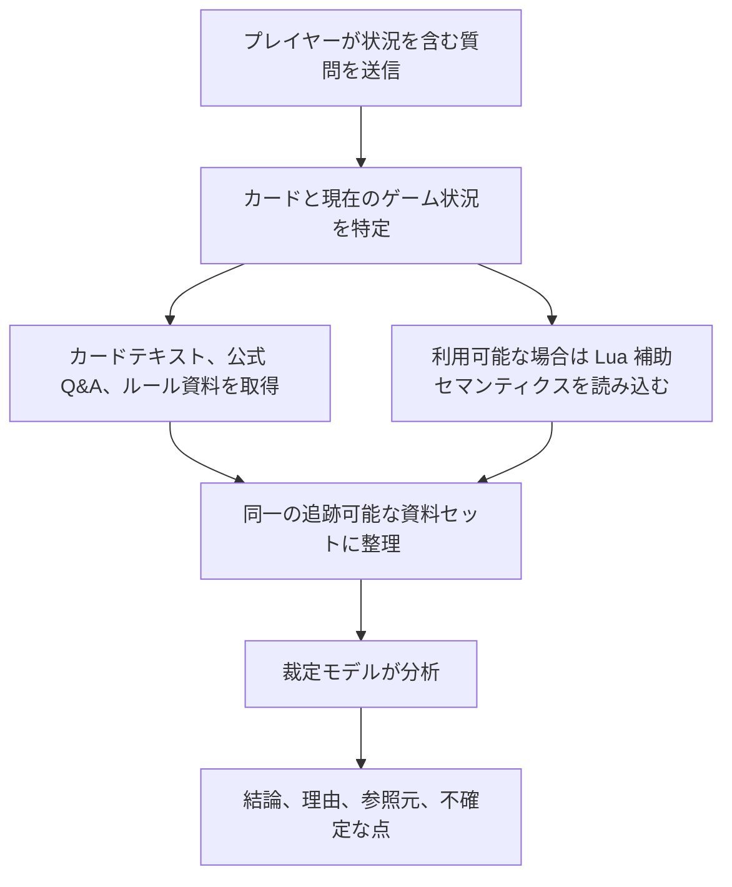

# 遊戯王 OCG 裁定アシスタント

[中文](README.md) | [English](README.en.md) | [日本語](README.ja.md)

[オンライン版を使う](https://coldiceh.github.io/ocg-ruling-assistant/) · [問題を報告する](https://github.com/coldiceh/ocg-ruling-assistant/issues)

遊戯王 OCG プレイヤー向けの裁定分析アシスタントです。カードテキスト、公開されているルール資料、公式 Q&A、利用可能な Lua 補助セマンティクスを組み合わせ、結論・理由・参照元を整理します。

KONAMI の公式プロジェクトではなく、公式大会におけるジャッジの判断に代わるものでもありません。

## できること

- カードの発動、チェーン、効果処理、タイミング、代替処理などの問題を分析します。
- 結論、分析理由、参照元、さらに確認が必要な点を表示します。
- 新しいカードがまだデータベースに収録されていない場合、ユーザーが貼り付けた完全な効果テキストをもとに未確認の分析を行います。
- モデル、推論強度、所要時間、正答率、費用を、固定問題セットで再現可能な形で評価します。

## 仕組み

## モデルと推論強度の評価

下表では、固定された評価問題と、すべての設定で共通の凍結済み資料だけを使用します。正解はモデルの回答後にオフラインで採点するためだけに使い、評価対象のモデルには送信しません。空の応答、形式エラー、採点不能な出力も、予定された呼び出し回数に含めます。第三者中継を通じて利用するモデルの実体と料金は、本プロジェクトでは独自に検証していません。実際の料金は中継サービスのダッシュボードを基準とします。

<!-- MODEL_EFFORT_MATRIX:START -->

> 厳密な実験は「Sol の全 6 段階 → 最低限安定する Sol の段階を選定 → Sol のみでアブレーション → 証拠構成を固定 → 他モデル」の順に、リモート環境で直列実行します。完了後、完全なテスト問題、各問の結果、正答率、所要時間、Token 数、推定費用を表で掲載します。

<!-- MODEL_EFFORT_MATRIX:END -->

## データと参照元

- [遊戯王 OCG 公式カードデータベースとカード Q&A](https://www.db.yugioh-card.com/yugiohdb/)
- 一般公開されているカードテキスト、FAQ、ルールブック、ルール学習資料
- [Fluorohydride/ygopro-core](https://github.com/Fluorohydride/ygopro-core) および YGOPro Lua スクリプトのインターフェースセマンティクス
- [羅伽氏がまとめた遊戯王ルール関連コンテンツ](https://space.bilibili.com/869711)
- ユーザーが質問内で提示した完全なカードテキストとゲーム状況

第三者による整理、コミュニティ資料、ユーザー提供のテキストを、KONAMI による直接の公式裁定として表示することはありません。

## 免責事項

本プロジェクトは KONAMI の公式プロジェクトではありません。分析には誤り、見落とし、誤判定が含まれる可能性があります。大会、店舗イベント、公式イベントでは、公式ルール、公式データベース、イベント主催者、現地ジャッジの判断に従ってください。
