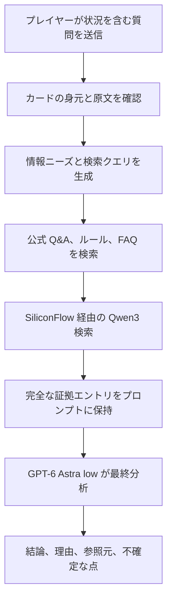

# 遊戯王OCG AI裁定

[中文](README.md) | [English](README.en.md) | [日本語](README.ja.md)

[オンライン版を使う](https://coldiceh.github.io/ocg-ruling-assistant/) · [問題を報告する](https://github.com/coldiceh/ocg-ruling-assistant/issues)

遊戯王OCG AI裁定は、OCG プレイヤー向けの裁定分析ツールです。カードテキスト、公開されているルール資料、公式 Q&A を組み合わせ、結論・理由・参照元を整理します。

KONAMI の公式プロジェクトではなく、公式大会におけるジャッジの判断に代わるものでもありません。

## できること

- カードの発動、チェーン、効果処理、タイミング、代替処理などの問題を分析します。
- 結論、分析理由、参照元、さらに確認が必要な点を表示します。
- 新しいカードがまだデータベースに収録されていない場合、ユーザーが貼り付けた完全な効果テキストをもとに未確認の分析を行います。

## 仕組み

公開オンライン版では `cloud_evidence_v1` を使用します。まず質問中のカードの身元を確認し、対応する原文を取得します。確認できない言及は未確認のまま残します。質問が完全に一致する公式 Q&A を持つ場合は、その資料を直接使って回答できます。それ以外の質問では証拠の準備を続けます。

質問と確認済みカードテキストをもとに、クラウド側で情報ニーズと日本語の検索クエリを生成し、資料コーパスから公式 Q&A、ルール、FAQ などを検索します。現在の本番環境では SiliconFlow 経由の `Qwen/Qwen3-Embedding-0.6B` による密ベクトル検索と字句検索を組み合わせています。追加の `Qwen/Qwen3-Reranker-8B` は現在無効です。プロンプトに採用した資料は完全な証拠エントリとして保持し、約 36,000 文字のプロンプト予算に収まらないレコードは、保持済みのエントリを途中で切り詰めず、そのレコード全体を除外します。

最終回答は、デフォルトの `GPT-6 Astra`（推論強度 `low`）が生成します。原文の質問、確認済みカードテキスト、そのリクエストで準備された証拠をもとに分析し、結論、理由、不確定な点、参照元リンクを返します。

## データと参照元

- [遊戯王 OCG 公式カードデータベースとカード Q&A](https://www.db.yugioh-card.com/yugiohdb/)
- 一般公開されているカードテキスト、FAQ、ルールブック、ルール学習資料

## 免責事項

本プロジェクトは KONAMI の公式プロジェクトではありません。分析には誤り、見落とし、誤判定が含まれる可能性があります。大会、店舗イベント、公式イベントでは、公式ルール、公式データベース、イベント主催者、現地ジャッジの判断に従ってください。
