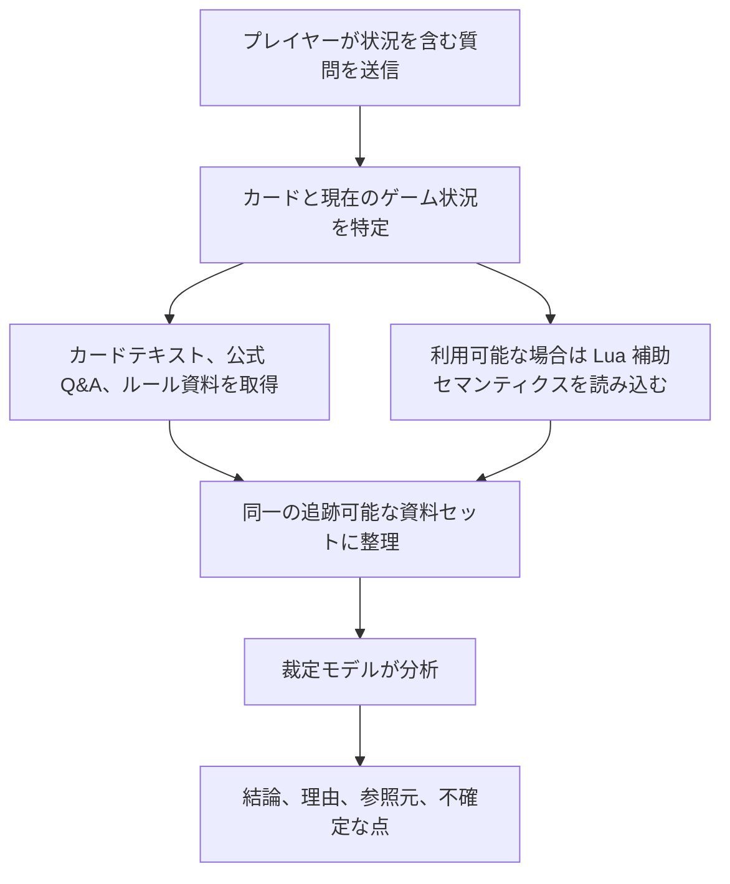

# 遊戯王 OCG 裁定アシスタント

[中文](README.md) | [English](README.en.md) | [日本語](README.ja.md)

[オンライン版を使う](https://coldiceh.github.io/ocg-ruling-assistant/) · [問題を報告する](https://github.com/coldiceh/ocg-ruling-assistant/issues)

遊戯王 OCG プレイヤー向けの裁定分析アシスタントです。カードテキスト、公開されているルール資料、公式 Q&A、利用可能な Lua 補助セマンティクスを組み合わせ、結論・理由・参照元を整理します。

KONAMI の公式プロジェクトではなく、公式大会におけるジャッジの判断に代わるものでもありません。

## できること

- カードの発動、チェーン、効果処理、タイミング、代替処理などの問題を分析します。
- 結論、分析理由、参照元、さらに確認が必要な点を表示します。
- 新しいカードがまだデータベースに収録されていない場合、ユーザーが貼り付けた完全な効果テキストをもとに未確認の分析を行います。
- モデル、推論強度、所要時間、正答率、費用を、固定問題セットで再現可能な形で評価します。

## 仕組み

## モデルと推論強度の評価

下表は10件の実際の裁定問題で GPT‑5.6 Sol の6段階の推論強度を比較したものです。正答率は各生回答のハッシュにひも付けた問題別の意味レビューだけに基づき、構造チェックと Validator は診断専用です。費用は公式の標準 API 価格と返却 Token から推定したもので、中継サービスの実際の請求額ではありません。

<!-- MODEL_EFFORT_MATRIX:START -->

### 10問での予備評価

Q1〜Q4 はプロンプト `0f6533ce…`、Q5〜Q10 は `d368c635…` で実行したため、これは異なるプロンプト版を含む予備的な表です。ただし、各問題については6段階すべてに同一の凍結入力を与えているため、同じ問題内での推論強度の比較はできます。正答率は回答本文を1問ずつ意味的に確認した結果だけであり、Validator の判定は含みません。

| 問題 | テストした内容 |
| --- | --- |
| Q1 | 発動中の通常罠と、カードを手札に戻す処理を含む効果の発動可否 |
| Q2 | 破壊の身代わりを重ねて適用できるか、その後に特殊召喚できるか |
| Q3 | チェーン処理中のS召喚後に誘発効果を発動できるタイミング |
| Q4 | 対象がいなくなった後、残りの効果処理を続けるか |
| Q5 | チェーン処理後に発動条件を満たすカードが場から離れた場合 |
| Q6 | 相手の手札がすでに公開されている場合の罠カードの発動可否 |
| Q7 | エクストラデッキから出たモンスターへの効果発動制限 |
| Q8 | 2種類の「追加で通常召喚できる」効果を併用できるか |
| Q9 | 融合素材の数と、破壊効果を発動できる回数 |
| Q10 | 直接攻撃を許可する効果と、攻撃対象を制限する効果の関係 |

| 推論強度 | 正答 | 主な未達 | 平均総所要時間 | 本文初出までの平均 | 合計 Token | 理論費用（合計 / 1問平均） |
| --- | --- | --- | ---: | ---: | ---: | ---: |
| none | 9/10 | Q2：空の応答 | 83.0秒 | 53.8秒 | 158,075 | $1.417490 / $0.141749 |
| low | 10/10 | — | 53.9秒 | 15.0秒 | 148,201 | $1.300830 / $0.130083 |
| medium | 9/10、ほか1問は一部正解 | Q4：出力が途中で切れ、確認を広げすぎた | 81.3秒 | 51.4秒 | 157,761 | $1.533735 / $0.153374 |
| high | 10/10 | — | 155.2秒 | 116.1秒 | 182,530 | $2.372484 / $0.237248 |
| xhigh | 9/10 | Q4：空の応答 | 247.3秒 | 198.2秒 | 216,435 | $3.375395 / $0.337540 |
| max | 7/10 | Q3・Q6：空の応答、Q4：タイムアウト | 441.6秒 | 308.0秒 | 224,570（計測できた9/10） | $3.837031 / $0.426337（計測できた9/10） |

強度によって反対の裁定を出した、という結果ではありません。Q2 は応答があった全強度で正解し、Q4 も none・low・medium・high の核心部分は一致しています。medium の Q4 は途中で切れたことと過剰な再確認、xhigh と max は回答を完了できなかったことが減点理由です。各条件は1回ずつしか実行していないため、low や high が乱数に対して常に安定することまでは証明できません。それでも今回の10問では low と high がともに10/10で、low のほうが大幅に速く安いため、現時点では **low を推奨**します。

### low での証拠構成の比較

| 証拠構成 | 正答 | 平均総所要時間 | 本文初出までの平均 | 合計 Token | 理論費用（合計 / 1問平均） |
| --- | ---: | ---: | ---: | ---: | ---: |
| カードテキストのみ | 4/10 | 45.2秒 | 17.4秒 | 76,855 | $0.876775 / $0.087678 |
| 完全な証拠 | 10/10 | 53.9秒 | 15.0秒 | 148,201 | $1.300830 / $0.130083 |
| Lua なし | 10/10 | 50.4秒 | 11.3秒 | 140,967 | $1.339285 / $0.133929 |

カードテキストだけでは4/10だったのに対し、ルールや公式Q&Aを含む証拠では10/10となり、これらの資料が重要であることが分かります。Lua の要約が実際に見つかったのは3/10だけで、今回の10問では Lua を外しても正答率は下がりませんでした。これは「この小規模なサンプルでは改善を確認できなかった」という意味に限られ、Lua が一般に不要だと証明するものではありません。

費用は友人の中継サービスの請求額ではなく、`openai-gpt-5.6-standard-2026-07-09` の公式理論単価に基づく試算です（2026-08-02確認）。

<!-- MODEL_EFFORT_MATRIX:END -->

## データと参照元

- [遊戯王 OCG 公式カードデータベースとカード Q&A](https://www.db.yugioh-card.com/yugiohdb/)
- 一般公開されているカードテキスト、FAQ、ルールブック、ルール学習資料
- [Fluorohydride/ygopro-core](https://github.com/Fluorohydride/ygopro-core) および YGOPro Lua スクリプトのインターフェースセマンティクス
- [羅伽氏がまとめた遊戯王ルール関連コンテンツ](https://space.bilibili.com/869711)
- ユーザーが質問内で提示した完全なカードテキストとゲーム状況

第三者による整理、コミュニティ資料、ユーザー提供のテキストを、KONAMI による直接の公式裁定として表示することはありません。

## 免責事項

本プロジェクトは KONAMI の公式プロジェクトではありません。分析には誤り、見落とし、誤判定が含まれる可能性があります。大会、店舗イベント、公式イベントでは、公式ルール、公式データベース、イベント主催者、現地ジャッジの判断に従ってください。
