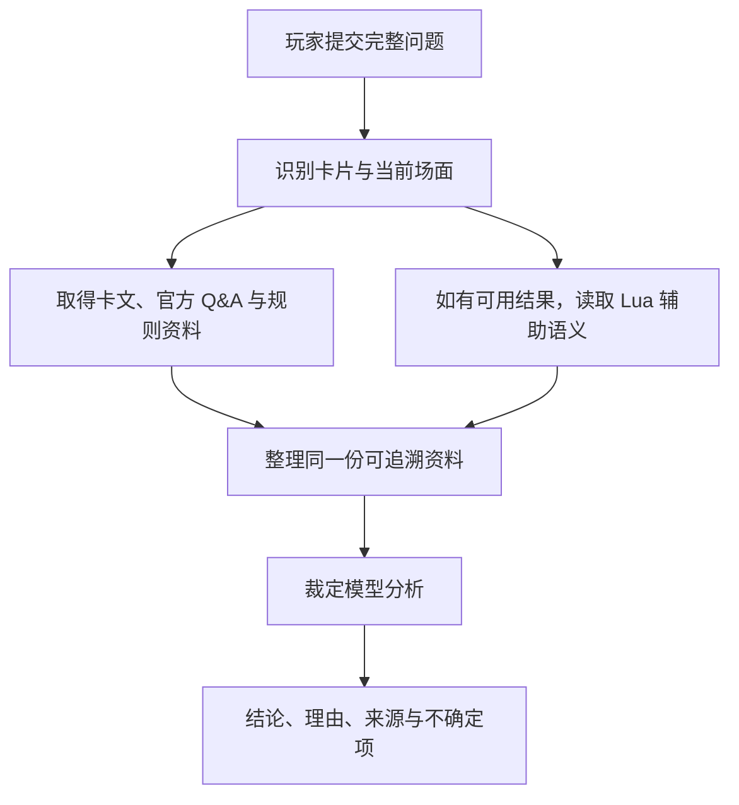

# 游戏王 OCG 裁定助手 / Yu-Gi-Oh! OCG Ruling Assistant

[中文](README.md) | [English](README.en.md) | [日本語](README.ja.md)

[在线使用](https://coldiceh.github.io/ocg-ruling-assistant/) · [问题反馈](https://github.com/coldiceh/ocg-ruling-assistant/issues)

这是一个面向游戏王 OCG 玩家的裁定分析助手。它会结合卡片文本、公开规则资料、官方 Q&A 和可用的 Lua 辅助语义，整理出结论、理由和参考来源。

它不是 KONAMI 官方项目，也不替代正式比赛的现场裁判。

## 可以做什么

- 分析卡片发动、连锁、效果处理、时点、替代处理等问题。
- 展示结论、分析理由、引用来源和仍需确认的地方。
- 在数据库暂未收录新卡时，根据用户粘贴的完整效果文本进行未确认分析。
- 对模型、推理强度、耗时、正确率和费用做可重现的固定题集测试。

## 工作原理

## 模型与推理强度测试

下表只使用固定评测题和同一份冻结资料。标准答案只在模型回答完成后用于离线评分，不会发给被测模型。空响应、格式失败和无法判分都计入计划调用数。第三方中转的模型身份与费率均未经本项目独立验证，实际收费以中转看板为准。

<!-- MODEL_EFFORT_MATRIX:START -->

> 严格实验按“Sol 六档 → 选出最低稳定档位 → 仅 Sol 消融 → 固定证据方案 → 其他模型”的顺序远程串行执行。完成后会在这里用表格列出完整测试题面、逐题结果、正确率、耗时、Token 和估算费用。

<!-- MODEL_EFFORT_MATRIX:END -->

## 数据与参考来源

- [游戏王 OCG 官方卡片数据库与 Q&A](https://www.db.yugioh-card.com/yugiohdb/)
- 公开可访问的卡片文本、FAQ、规则书与规则学习资料
- [Fluorohydride/ygopro-core](https://github.com/Fluorohydride/ygopro-core) 及其 YGOPro Lua 脚本接口语义
- [罗伽老师整理的游戏王规则内容](https://space.bilibili.com/869711)
- 用户在问题中提供的完整卡片文本和场面信息

第三方整理、社区资料和用户提供文本不会被标记为 KONAMI 官方直接裁定。

## 免责声明

本项目不是 KONAMI 官方项目。分析结果可能存在错误、遗漏或误判。正式比赛、店赛和官方活动请以官方规则、官方数据库、赛事主办方与现场裁判为准。
