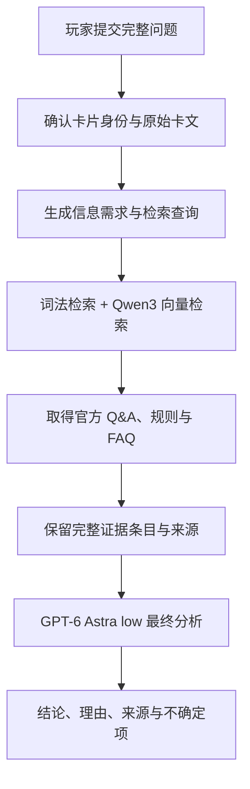

# 游戏王 OCG AI裁定 / Yu-Gi-Oh! OCG AI Rulings

[中文](README.md) | [English](README.en.md) | [日本語](README.ja.md)

[在线使用](https://coldiceh.github.io/ocg-ruling-assistant/) · [问题反馈](https://github.com/coldiceh/ocg-ruling-assistant/issues)

游戏王 OCG AI裁定面向所有 OCG 玩家，结合卡片文本、公开规则资料和官方 Q&A，整理结论、理由和参考来源。

它不是 KONAMI 官方项目，也不替代正式比赛的现场裁判。

## 可以做什么

- 分析卡片发动、连锁、效果处理、时点、替代处理等问题。
- 展示结论、分析理由、引用来源和仍需确认的地方。
- 在数据库暂未收录新卡时，根据用户粘贴的完整效果文本进行未确认分析。

## 工作原理

线上公开问答使用 `cloud_evidence_v1`。提交后先确认问题中的卡片身份，并取得对应的原始卡文；无法确认的提及会保留为未确认。找原题和原题直接作答线路暂时停用，所有公开问题统一进入证据检索与分析，官方 Q&A 和 FAQ 仍作为参考资料保留。

云端会根据问题和已确认卡文生成信息需求与日文查询，再从资料库检索官方 Q&A、规则和 FAQ 等资料。当前线上使用 `Qwen/Qwen3-Embedding-0.6B` 做稠密检索并结合词法检索；额外的 `Qwen/Qwen3-Reranker-8B` 目前未启用。选入提示的资料按完整证据条目保留；若单条记录无法放入约 36,000 字符的提示预算，则跳过该条，不截断已保留的条目。

最终由默认的 `GPT-6 Astra`（推理强度 `low`）依据原始问题、确认的卡文和本次证据逐项分析，返回结论、理由、不确定项和来源链接。整条问答流程在云端运行；AI 仍可能误读规则或遗漏条件，请结合显示的依据核对。

## 数据与参考来源

- [游戏王 OCG 官方卡片数据库与 Q&A](https://www.db.yugioh-card.com/yugiohdb/)
- 公开可访问的卡片文本、FAQ、规则书与规则学习资料

## 免责声明

本项目不是 KONAMI 官方项目。分析结果可能存在错误、遗漏或误判。正式比赛、店赛和官方活动请以官方规则、官方数据库、赛事主办方与现场裁判为准。
