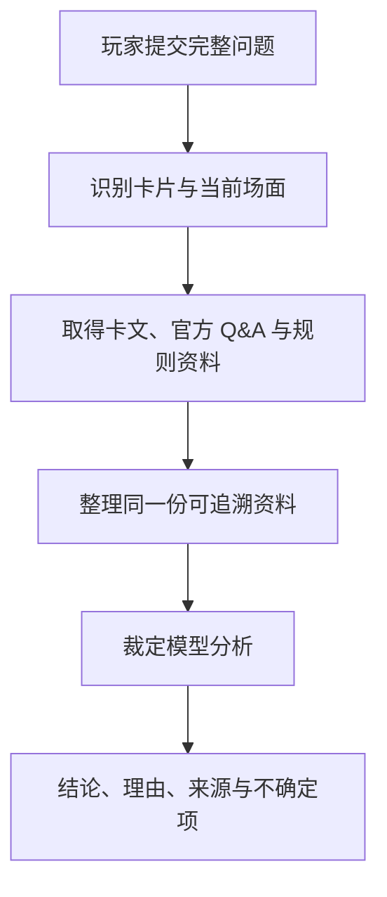

# 游戏王 OCG AI裁定 / Yu-Gi-Oh! OCG AI Rulings

[中文](README.md) | [English](README.en.md) | [日本語](README.ja.md)

[在线使用](https://coldiceh.github.io/ocg-ruling-assistant/) · [问题反馈](https://github.com/coldiceh/ocg-ruling-assistant/issues)

游戏王 OCG AI裁定面向所有 OCG 玩家，结合卡片文本、公开规则资料和官方 Q&A，整理结论、理由和参考来源。

它不是 KONAMI 官方项目，也不替代正式比赛的现场裁判。

## 可以做什么

- 分析卡片发动、连锁、效果处理、时点、替代处理等问题。
- 展示结论、分析理由、引用来源和仍需确认的地方。
- 在数据库暂未收录新卡时，根据用户粘贴的完整效果文本进行未确认分析。
- 对模型、推理强度、耗时、正确率和费用做可重现的固定题集测试。

## 工作原理

## 模型与推理强度测试

下表汇总匿名真实场景评测；这份公开报告只列正确率、耗时、Token、理论费用与技术失败统计，不展示具体问题、卡名或逐题输出。

人民币约值按 2026-08 的 `1 USD ≈ CN¥6.8` 换算，仅便于阅读；实际费用仍以 USD 理论单价与 Token 计量为准。

<!-- MODEL_EFFORT_MATRIX:START -->

评测规模为匿名 10 题；每个配置每题只调用一次。正确率按原始回答的实际语义复核，部分正确单独计数；空响应、超时、截断等只按技术失败类型汇总。各配置对同一道题使用冻结输入，但样本来自两个提示词版本，因此这是初步评测，不代表随机重复运行的稳定性。

### GPT‑5.6 模型与六档推理强度

| 模型 | 推理强度 | 正确 | 部分正确 | 平均 / 中位耗时 | Token（输入 / 输出 / 推理 / 总计） | 官方理论总费用（USD / 约人民币） | 技术失败 |
| --- | --- | ---: | ---: | ---: | ---: | ---: | --- |
| Luna | none | 10/10 | 0 | 41.5 / 37.9 s | 120,457 / 22,367 / 6,794 / 142,824 | USD 0.050932 约 CN¥0.35 | — |
| Luna | low | 10/10 | 0 | 34.6 / 31.3 s | 120,457 / 18,133 / 2,014 / 138,590 | USD 0.045851 约 CN¥0.31 | — |
| Luna | medium | 7/10 | 2 | 44.2 / 39.3 s | 123,487 / 22,697 / 8,275 / 146,184 | USD 0.051934 约 CN¥0.35 | 空响应 1 |
| Luna | high | 9/10 | 1 | 139.8 / 126.2 s | 120,457 / 76,889 / 57,182 / 197,346 | USD 0.116358 约 CN¥0.79 | — |
| Luna | xhigh | 7/10 | 2 | 268.2 / 237.4 s | 123,487 / 145,316 / 124,278 / 268,803 | USD 0.199077 约 CN¥1.35 | 空响应 1 |
| Luna | max | 6/10 | 0 | 284.0 / 267.2 s | 157,404 / 109,577 / 94,309 / 266,981 | USD 0.162973 约 CN¥1.11 | 空响应 4 |
| Terra | none | 7/10 | 1 | 43.7 / 41.4 s | 122,821 / 23,409 / 6,211 / 146,230 | USD 0.526550 约 CN¥3.58 | 空响应 1 |
| Terra | low | 10/10 | 0 | 39.4 / 35.7 s | 120,457 / 21,090 / 3,307 / 141,547 | USD 0.493994 约 CN¥3.36 | — |
| Terra | medium | 8/10 | 1 | 41.9 / 39.5 s | 123,293 / 21,247 / 5,431 / 144,540 | USD 0.501550 约 CN¥3.41 | 空响应 1 |
| Terra | high | 9/10 | 1 | 89.3 / 77.1 s | 120,457 / 48,212 / 29,577 / 168,669 | USD 0.819458 约 CN¥5.57 | — |
| Terra | xhigh | 9/10 | 1 | 195.7 / 199.0 s | 120,457 / 107,700 / 87,027 / 228,157 | USD 1.533314 约 CN¥10.43 | — |
| Terra | max | 4/10 | 1 | 574.9 / 541.8 s | 91,403 / 146,592 / 135,622 / 237,995 | USD 1.941910 约 CN¥13.20（7/10 有计量） | 超时 3、空响应 2 |
| Sol | none | 10/10 | 0 | 78.3 / 69.0 s | 121,937 / 33,861 / 13,772 / 155,798 | USD 1.625515 约 CN¥11.05 | — |
| **Sol** | **low** | **10/10** | **0** | **51.6 / 47.9 s** | 122,233 / 26,268 / 3,793 / 148,501 | **USD 1.399205** **约 CN¥9.51** | — |
| Sol | medium | 10/10 | 0 | 73.2 / 73.3 s | 122,233 / 33,827 / 14,475 / 156,060 | USD 1.625975 约 CN¥11.06 | — |
| Sol | high | 9/10 | 0 | 122.3 / 112.7 s | 123,980 / 49,507 / 31,647 / 173,487 | USD 2.105110 约 CN¥14.31 | 空响应 1 |
| Sol | xhigh | 9/10 | 0 | 226.3 / 173.0 s | 123,675 / 94,257 / 74,322 / 217,932 | USD 3.446085 约 CN¥23.43 | 空响应 1 |
| Sol | max | 8/10 | 0 | 465.5 / 349.6 s | 111,845 / 141,422 / 121,661 / 253,267 | USD 4.801885 约 CN¥32.65（9/10 有计量） | 超时 1、空响应 1 |

理论费用按当前官方标准 API 列表价重新计算，并保守地把全部输入 Token 当作未缓存输入；没有扣除实际可能获得的缓存优惠。人民币按约 1 USD ≈ CN¥6.8 换算。

上表是旧的 10 题小样本：**Luna low** 当时取得了 10/10，且在满分 GPT‑5.6 配置中平均耗时最短、理论费用最低；但它后来在样本外规则问题中出现错误，说明这 10 题不能代表泛化能力，也不再作为推荐依据。当前公开版本优先使用 **Sol low**；Sol low 在这组旧样本中同样是 10/10，但仍可能答错新的复杂规则问题，不构成正确率保证。更高推理强度也没有稳定提高正确率，并显著增加了耗时、Token 与技术失败风险。

### DeepSeek 对照

`Flash` / `Pro` 是模型版本，`standard` / `pro` 是接口提供的推理模式，`none` / `high` / `max` 是请求的推理强度。后两项的真实后端映射由实际供应商决定。

| 模型 | 模式 | 推理强度 | 正确 | 部分正确 | 平均 / 中位耗时 | Token（输入 / 输出 / 推理 / 总计） | 官方理论总费用（USD / 约人民币） | 技术失败 |
| --- | --- | --- | ---: | ---: | ---: | ---: | ---: | --- |
| Flash | standard | none | 5/10 | 4 | 12.4 / 12.4 s | 115,416 / 16,671 / 0 / 132,087 | USD 0.020826 约 CN¥0.14 | — |
| Flash | pro | high | 1/10 | 0 | 78.4 / 84.7 s | 11,469 / 8,194 / 7,815 / 19,663 | USD 0.003900 约 CN¥0.03（1/10 有计量） | 上游失败 9、截断 1 |
| Pro | standard | none | 5/10 | 2 | 25.3 / 23.8 s | 115,416 / 19,534 / 0 / 134,950 | USD 0.067201 约 CN¥0.46 | 格式无效 1 |
| Pro | pro | max | 4/10 | 0 | 146.4 / 147.2 s | 48,625 / 31,478 / 26,131 / 80,103 | USD 0.048538 约 CN¥0.33（4/10 有计量） | 上游失败 6、截断 2 |

DeepSeek 的 standard 模式很快且便宜，但这组样本的严格正确率不足以作为主裁定模型。pro 模式的大量空响应来自上游执行失败，不能单凭这些结果判断其规则推理能力。

### 证据消融

| 匿名样本 | 证据方案 | 正确 | 部分正确 | 平均 / 中位耗时 | 总 Token | 官方理论总费用（USD / 约人民币） |
| --- | --- | ---: | ---: | ---: | ---: | ---: |
| 10 题 | 仅卡文 | 4/10 | 0 | 45.2 / 43.3 s | 76,855 | USD 0.876775 约 CN¥5.96 |
| 10 题 | 完整资料 | 10/10 | 0 | 53.9 / 47.8 s | 148,201 | USD 1.387230 约 CN¥9.43 |

规则与 Q&A 资料在这组样本中带来了明显收益。

GPT‑5.6 与 DeepSeek 的费用均按各自官方标准 API 理论单价和返回 Token 估算，不采用实际供应商的倍率、账户余额或账单；计量不完整的配置已明确标注。

<!-- MODEL_EFFORT_MATRIX:END -->

## 数据与参考来源

- [游戏王 OCG 官方卡片数据库与 Q&A](https://www.db.yugioh-card.com/yugiohdb/)
- 公开可访问的卡片文本、FAQ、规则书与规则学习资料
- [罗伽老师整理的游戏王规则内容](https://space.bilibili.com/869711)

## 免责声明

本项目不是 KONAMI 官方项目。分析结果可能存在错误、遗漏或误判。正式比赛、店赛和官方活动请以官方规则、官方数据库、赛事主办方与现场裁判为准。
