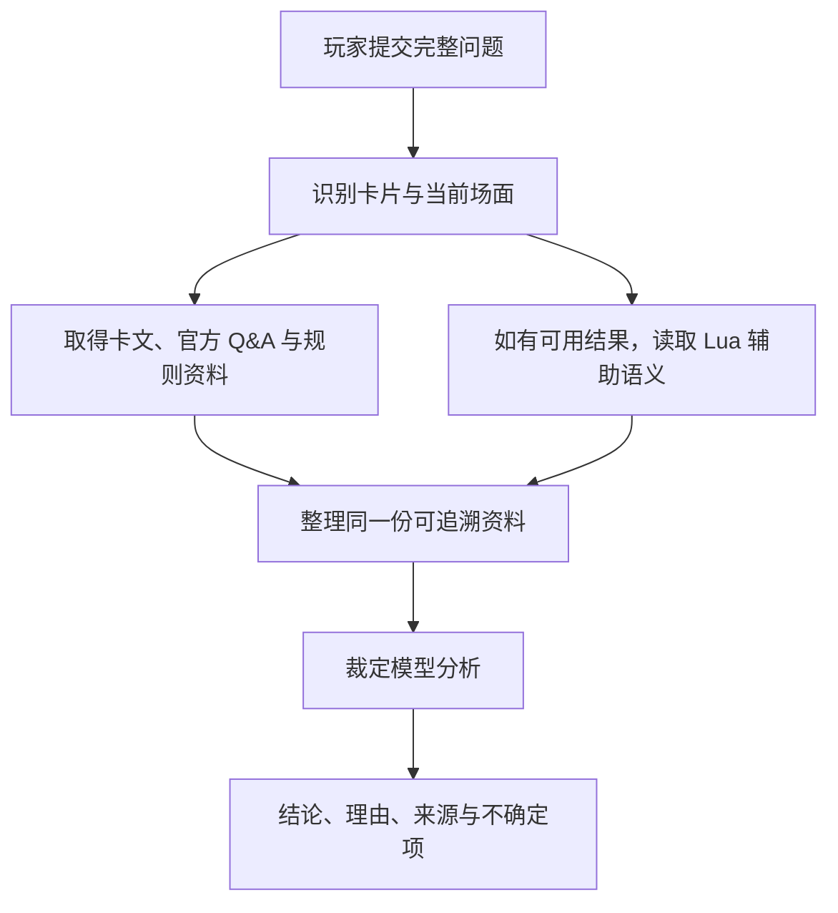

# 游戏王 OCG 裁定助手 / Yu-Gi-Oh! OCG Ruling Assistant

[中文](README.md) | [English](README.en.md) | [日本語](README.ja.md)

[在线使用](https://coldiceh.github.io/ocg-ruling-assistant/) · [问题反馈](https://github.com/coldiceh/ocg-ruling-assistant/issues)

这是一个面向游戏王 OCG 玩家的裁定分析助手。它会结合卡片文本、公开规则资料、官方 Q&A 和可用的 Lua 辅助语义，整理出结论、理由和参考来源。

它不是 KONAMI 官方项目，也不替代正式比赛的现场裁判。

## 可以做什么

- 分析卡片发动、连锁、效果处理、时点、替代处理等问题。
- 展示结论、分析理由、引用来源和仍需确认的地方。
- 在数据库暂未收录新卡时，根据用户粘贴的完整效果文本进行未确认分析。
- 对模型、推理强度、耗时、正确率和费用做可重现的固定题集测试。

## 工作原理

## 模型与推理强度测试

下表使用十道真实问题比较 GPT‑5.6 Sol 的六个推理档位。正确率来自与原始输出哈希绑定的逐题语义复核；结构检查和 Validator 只作诊断，不参与正确率。费用按官方标准 API 理论单价与返回 Token 估算，不代表第三方中转的实际账单。

<!-- MODEL_EFFORT_MATRIX:START -->

### 十道测试题覆盖的机制

| 编号 | 主要考点 |
| --- | --- |
| Q1 | 《无限泡影》与《天雷之双风神》的发动合法性 |
| Q2 | 连续破坏代替与《破械冥官·篁》的后续处理 |
| Q3 | 连锁处理后另组连锁与同步召唤时点 |
| Q4 | 对象或发动源离开后的继续处理 |
| Q5 | 诱发效果实际发动时的场上条件 |
| Q6 | 已公开手牌与陷阱发动条件 |
| Q7 | 额外牌组怪兽效果的持续发动限制 |
| Q8 | 多个追加通常召唤效果能否叠加 |
| Q9 | 融合素材数量与效果发动次数 |
| Q10 | 攻击对象限制与直接攻击 |

### 六档完整资料结果

| 推理强度 | 正确率 | 未答对的原因 | 平均总耗时 | 平均首正文 | 总 Token | 理论费用（总计 / 每题） |
| --- | --- | --- | ---: | ---: | ---: | ---: |
| none | 9/10（90%） | Q2 空响应 | 83.0 s | 53.8 s | 158,075 | USD 1.417490 / 0.141749 |
| **low** | **10/10（100%）** | — | **53.9 s** | **15.0 s** | 148,201 | **USD 1.300830 / 0.130083** |
| medium | 9/10（90%），另 1 题部分正确 | Q4 核心裁定正确，但过度复核且 JSON 中途截断 | 81.3 s | 51.4 s | 157,761 | USD 1.533735 / 0.153374 |
| high | 10/10（100%） | — | 155.2 s | 116.1 s | 182,530 | USD 2.372484 / 0.237248 |
| xhigh | 9/10（90%） | Q4 空响应 | 247.3 s | 198.2 s | 216,435 | USD 3.375395 / 0.337540 |
| max | 7/10（70%） | Q3、Q6 空响应；Q4 在 900.0 s 超时 | 441.6 s | 308.0 s | 224,570（9/10 有计量） | USD 3.837031 / 0.426337（9/10 有计量） |

None、xhigh 和 max 的上述失败没有产生相反裁定，而是没有可用最终回答。Q2 的五个非空档位都给出相同正确结论；Q4 中 none、low、medium、high 的核心裁定也一致，Medium 只是输出截断并受旧提示词影响而过度检查。由此看，Low 和 High 的正确答案有明确证据支持，并非只猜中“能/不能”。不过每个配置每题只调用一次，仍不足以证明随机稳定性。

本轮建议优先使用 **low**：它和 High 都是 10/10，但平均总耗时约为 High 的三分之一，理论费用也更低。

### Low 的证据消融

| 证据方案 | 正确率 | 平均总耗时 | 平均首正文 | 总 Token | 理论费用（总计 / 每题） |
| --- | ---: | ---: | ---: | ---: | ---: |
| 仅卡文 | 4/10（40%） | 45.2 s | 17.4 s | 76,855 | USD 0.876775 / 0.087678 |
| 完整资料 | 10/10（100%） | 53.9 s | 15.0 s | 148,201 | USD 1.300830 / 0.130083 |
| 不含 Lua | 10/10（100%） | 50.4 s | 11.3 s | 140,967 | USD 1.339285 / 0.133929 |

这说明卡文之外的规则与 Q&A 资料对本组题目非常重要。Lua 摘要实际命中 3/10；完整资料与不含 Lua 都是 10/10，因此本次没有观察到 Lua 带来的正确率提升。这个结果只适用于当前十题，不能证明 Lua 对其他题目无用。

Q1–Q4 使用旧提示词 `0f6533ce…`，Q5–Q10 使用新提示词 `d368c635…`。每一道题在六档之间的冻结输入一致，但十题并非同一提示词版本，所以这里是初步的混合版本评测，不是严格统一版本基准。

理论费用采用 `openai-gpt-5.6-standard-2026-07-09` 价目版本（2026-08-02 核对），不是中转余额或实际账单。

<!-- MODEL_EFFORT_MATRIX:END -->

## 数据与参考来源

- [游戏王 OCG 官方卡片数据库与 Q&A](https://www.db.yugioh-card.com/yugiohdb/)
- 公开可访问的卡片文本、FAQ、规则书与规则学习资料
- [Fluorohydride/ygopro-core](https://github.com/Fluorohydride/ygopro-core) 及其 YGOPro Lua 脚本接口语义
- [罗伽老师整理的游戏王规则内容](https://space.bilibili.com/869711)
- 用户在问题中提供的完整卡片文本和场面信息

第三方整理、社区资料和用户提供文本不会被标记为 KONAMI 官方直接裁定。

## 免责声明

本项目不是 KONAMI 官方项目。分析结果可能存在错误、遗漏或误判。正式比赛、店赛和官方活动请以官方规则、官方数据库、赛事主办方与现场裁判为准。
