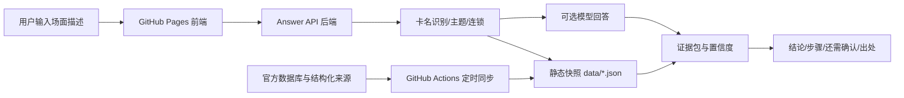

# 架构说明

## 总体结构



## 前端

- `index.html`：工具界面。
- `src/styles.css`：界面样式。
- `src/app.js`：读取配置、调用后端、后端不可用时做保守检索。

页面不需要构建，适合 GitHub Pages。前端会尝试读取：

- `config.json`
- `data/cards-lite.json`
- `data/snapshot-meta.json`

如果没有配置后端，会退回到静态模式，再读取 `data/cards.json` 和 `data/rulings.json` 做有限检索。

## 后端

- `api/answer.js`：Vercel Function 入口。
- `backend/server.mjs`：本地开发服务，默认 `http://localhost:8787/api/answer`。
- `backend/engine.mjs`：加载快照、识别卡名、检索证据、生成保守回答。
- `backend/openai.mjs`：可选模型回答层，支持 Gemini 和 OpenAI；只有设置对应 API key 和模型名时启用。

后端返回统一结构：

```json
{
  "mode": "confirmed | inferred | unknown",
  "verdictTitle": "结论标题",
  "verdict": "结论正文",
  "confidence": { "label": "已确认资料", "value": 86, "className": "is-confirmed" },
  "steps": ["处理步骤"],
  "needsConfirmation": ["还需确认"],
  "sources": [{ "label": "来源", "detail": "https://..." }]
}
```

## 数据同步

- `scripts/sync-ygoresources.mjs` 负责生成静态快照。
- `data/tracked-cards.json` 负责声明重点别名和补充卡片；默认同步全已发售卡基础资料。
- `.github/workflows/sync-data.yml` 定时运行同步。

同步脚本不直接写死裁定结论；它只把外部结构化资料标准化为前端可以检索的 JSON。
`cards-lite.json` 给前端做轻量卡名识别，`cards.json` 和 `rulings.json` 给后端做完整检索。

## 置信度

置信度由三类因素共同决定：

- 条目状态：`confirmed`、`provisional`、`needs-source`。
- 问题完整度：俗称是否能解析到卡片、是否缺完整文本、连锁、表示形式。
- 快照新鲜度：是否超过 `freshnessDays`。

如果快照过期，即使命中已确认条目也会降级。

## 后续扩展

- 把 Q&A 检索从 JSON 扩展到全文索引或向量索引。
- 保存裁定变更历史。
- 为“能否发动”“伤害计算”“代替破坏”等高频问题增加可审计规则模块。
- 让模型只负责解释证据包和结构化场面，不直接决定“已确认”状态。
