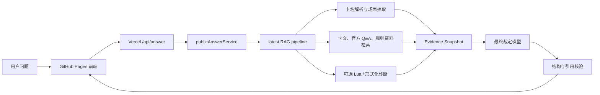
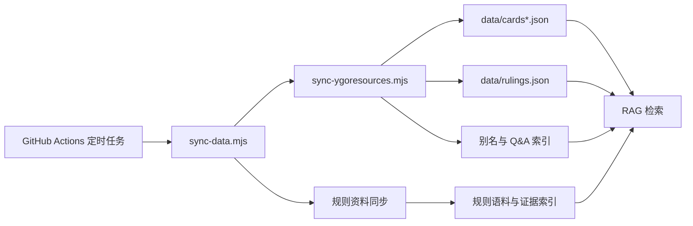

# 当前架构

本文只描述当前生产实现。历史实验、已删除的规则引擎原型和冻结回答版本不属于生产调用链。

## 请求链路

```mermaid
flowchart LR
  A["用户问题"] --> B["GitHub Pages 前端"]
  B --> C["Vercel /api/answer"]
  C --> D["publicAnswerService"]
  D --> E["latest RAG pipeline"]
  E --> F["卡名解析与场面抽取"]
  E --> G["卡文、官方 Q&A、规则资料检索"]
  E --> H["可选 Lua / 形式化诊断"]
  F --> I["Evidence Snapshot"]
  G --> I
  H --> I
  I --> J["最终裁定模型"]
  J --> K["结构与引用校验"]
  K --> B
```

## 入口与职责

- `index.html`、`src/app.js`、`src/styles.css`：静态网页与 API 客户端。
- `api/answer.js`：Vercel 公开回答入口，只负责 HTTP、CORS 和中断传播。
- `backend/server.mjs`：本地开发服务器；公开回答同样调用共享服务。
- `backend/publicAnswerService.mjs`：统一 Vercel 与本地入口的请求限制、模型配置、版本选择、审计、耗时记录和错误映射。
- `backend/rulingVersionRegistry.mjs`：当前只允许 `latest`，并转发到 `backend/ragRulingPipeline.mjs`。
- `backend/ragRulingPipeline.mjs`：组织卡名抽取、证据检索、提示词、模型调用及最终结果校验。
- `backend/ragEvidenceRetriever.mjs`、`backend/officialQaMatcher.mjs`：构建并评估证据，区分直接适用、相关但有条件以及前提不匹配的资料。
- `backend/ragRulingPrompt.mjs`、`backend/ragModelClient.mjs`：构建最终模型输入并调用服务端配置的模型。

浏览器不会接收模型 API Key，也不能通过请求体任意选择未公开的供应商或模型。管理模型实验室使用独立的认证、路由和存储，不进入公开回答入口。

## 数据链路

```mermaid
flowchart LR
  A["GitHub Actions 定时任务"] --> B["sync-data.mjs"]
  B --> C["sync-ygoresources.mjs"]
  B --> D["规则资料同步"]
  C --> E["data/cards*.json"]
  C --> F["data/rulings.json"]
  C --> G["别名与 Q&A 索引"]
  D --> H["规则语料与证据索引"]
  E --> I["RAG 检索"]
  F --> I
  G --> I
  H --> I
```

`backend/dataIndex.mjs` 是同步链路使用的索引构建工具，不是旧回答引擎。同步脚本只标准化外部资料和生成索引，不写入具体题目的裁定答案。

## 证据边界

- 卡片文本、官方 Q&A、规则资料和社区资料保留各自来源与权威等级。
- 相似 Q&A 必须核对所问阶段、参与卡片和场景前提；前提不一致时只能作为条件对照。
- Lua 与形式化内核结果属于辅助诊断；缺失、超时或无法验证时不得伪装成官方真值。
- 最终结构校验负责 JSON、引用和证据绑定，不应凭启发式规则覆盖模型的实体裁定。

## 部署

- GitHub Pages 发布静态前端和轻量卡片快照。
- Vercel 承载公开回答与管理 API。
- `.github/workflows/sync-data.yml` 定时更新资料；`.github/workflows/deploy-pages.yml` 在发布前执行源码检查和串行测试。
