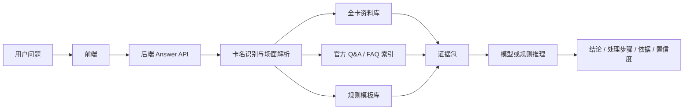

# 全卡裁定问答方案

## 目标

对已经在官方数据库收录并发售的卡，系统应尽量回答：

- 能否发动。
- 效果如何处理。
- 连锁和时点如何判断。
- 控制权、表示形式、区域变化、代替破坏、伤害计算等复杂场面。

没有官方 Q&A 或资料不足时，系统必须明确说明“不能确定”，不能用相似但无关的卡片文本套答案。

## 为什么不能只靠 GitHub Pages

GitHub Pages 只能托管静态文件，适合展示同步快照和做简单检索，但不适合承担完整裁定问答：

- 全卡资料和 Q&A 数据量较大，浏览器端全文检索和推理能力有限。
- 官方资料会更新，需要增量同步、版本记录和过期处理。
- 复杂场面需要把自然语言拆成结构化状态，再基于资料和规则推理。
- 若接入大模型，API key 不能放在前端。

因此 GitHub Pages 前端只能做安全入口；真正回答应由后端服务完成。

## 推荐架构



## 回答策略

1. 先识别题目中的卡名，允许俗称和民间译名，但最终必须能映射到资料库中的真实卡片。
2. 只检索命中卡及其相关 Q&A，不允许用未出现的卡片文本作为答案。
3. 优先返回官方 Q&A 或卡片 FAQ。
4. 若只命中效果文本，不能直接给确定裁定，只能说明缺少 Q&A 并列出需要确认的规则点。
5. 若进入规则推理，必须把“推定”和“已确认裁定”分开显示。
6. 每个结论必须附资料来源和快照时间。

## 裁判式管线

后端不应该围绕某张卡写特判，而应该把问题拆成可复用的裁判步骤：

1. 规范化卡名：把俗称、日文名、英文名和不同来源的同一卡合并到同一个卡号。
2. 抽取场面事实：区域、控制者、表示形式、连锁、发动时点、正在适用的效果和被处理的卡。
3. 识别效果类型：例如发动无效、回卡组、临时除外到处理后、代替破坏、伤害变更、控制权变更。
4. 检索数据库原题：完全同卡、同效果类型、同处理时点的 Q&A/FAQ 优先，命中后才能标记为已确认资料。
5. 检索相似裁定：只作为类推依据，必须列出共通结构和差异点。
6. 应用可审计规则模块：按“当前正在处理什么、哪个效果能否在此时适用、对象是否仍在原位置、剩余处理如何执行、处理后状态是什么”的顺序推导。
7. 输出保守结论：没有足够出处时显示推定或不能确定，不能把模型猜测显示成已确认裁定。

模型只能负责解释证据包、补充自然语言表达和辅助卡名解析；它不能越过资料和规则模块直接决定“官方确认”。

## 后端可选实现

- Cloudflare Worker：适合轻量 API，部署简单。
- Vercel Function：适合快速接入模型 API。
- Node.js 服务：适合自建数据库和索引。

当前仓库已经实现最小后端接口：

```http
POST /api/answer
Content-Type: application/json

{
  "question": "自然语言规则疑问"
}
```

返回：

```json
{
  "mode": "confirmed | inferred | unknown",
  "verdictTitle": "结论标题",
  "verdict": "结论",
  "confidence": { "label": "已确认资料", "value": 86, "className": "is-confirmed" },
  "steps": ["处理步骤"],
  "needsConfirmation": ["仍需确认"],
  "sources": [{ "label": "来源", "detail": "来源链接" }],
  "snapshotAt": "2026-06-16T00:00:00.000Z"
}
```

相关文件：

- `api/answer.js`：Vercel 部署入口。
- `backend/server.mjs`：本地开发服务。
- `backend/engine.mjs`：资料检索和保守回答。
- `backend/openai.mjs`：可选模型回答层。

部署时设置：

- `MODEL_PROVIDER`：指定模型提供商，可填 `gemini` 或 `openai`。
- `GEMINI_API_KEY` / `GEMINI_MODEL`：启用 Gemini 模型回答。
- `OPENAI_API_KEY` / `OPENAI_MODEL`：启用 OpenAI 模型回答。
- `ALLOWED_ORIGIN`：限制允许访问 API 的前端域名。

## 当前静态版的边界

当前静态版只做安全检索：

- 能识别同步快照里的卡名。
- 能展示命中的 Q&A / FAQ。
- 只命中效果文本时，不给具体裁定。
- 不能保证回答所有已发售卡的复杂场面。

要达到目标，需要继续实现后端 Answer API。

## 当前已完成

- 前端支持通过 `config.json` 调用后端。
- 后端支持 `POST /api/answer`。
- 同步脚本支持默认同步已发售全卡基础资料。
- 后端支持本地别名和模型辅助卡名解析，降低必须输入官方全名的要求。
- 只命中效果文本时，不显示为确定裁定。
- 后端模型回答必须基于证据包，并会在缺少直接 Q&A/FAQ 时降级为推定或未知。

## 仍需继续

- 扩大 `MAX_QA_TOTAL`，逐步同步更完整的 Q&A。
- 增加真正的规则模块，覆盖发动合法性、伤害计算、代替破坏、控制权变化等常见复杂场面。
- 增加裁定变更对比和历史版本。
- 补充中文俗称和译名索引。
